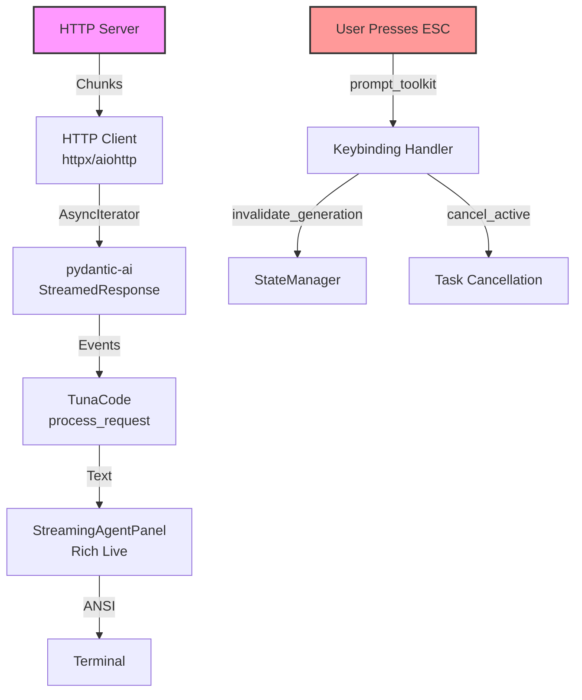
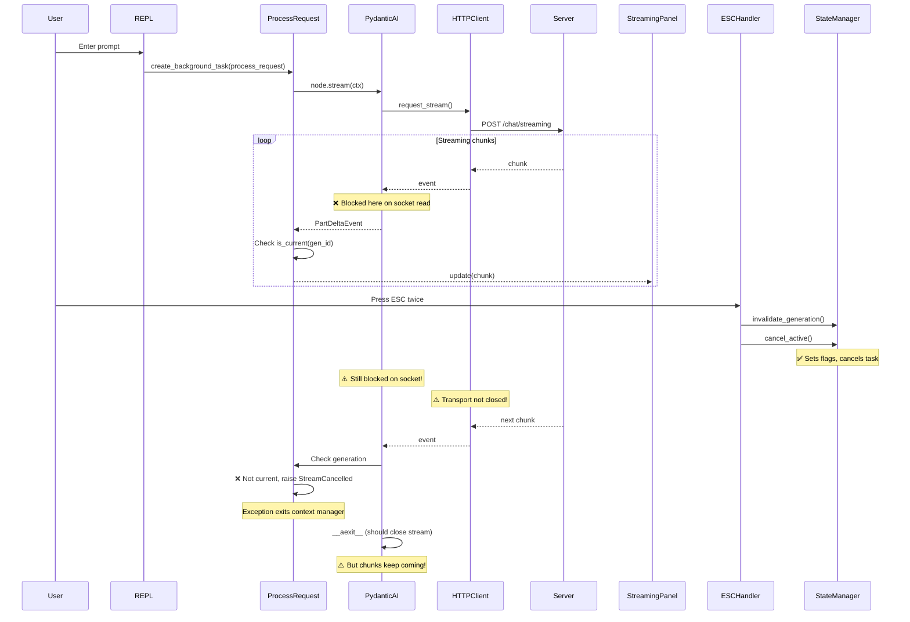
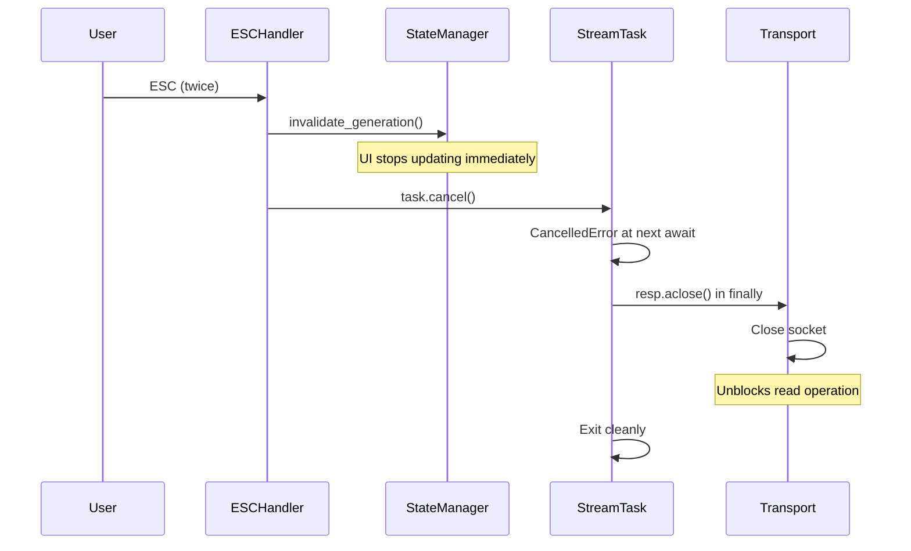

# ESC Key Streaming Cancellation: First Principles Analysis

## Executive Summary

The ESC key fails to immediately stop streaming output because:

1. The streaming runs in the main REPL task, not its own cancellable task
2. pydantic-ai doesn't expose the underlying HTTP transport for closure
3. While we check generation IDs, we can't interrupt the blocked I/O operation

## The Streaming Stack



## Current Flow: Why Cancellation Fails



## Why Our Attempts Failed

### 1. Generation-Based Gating (Partial Success ✓)

```python
# What we did:
if not state_manager.is_current(gen_id):
    logger.debug(f"Generation {gen_id} invalidated, breaking stream")
    break
```

**Why it's not enough**: We only check AFTER receiving a chunk. While blocked on `async for event in request_stream`, we can't check anything.

### 2. Exception-Based Context Exit (Good Approach ✓)

```python
# What we did:
if not state_manager.is_current(gen_id):
    raise StreamCancelled()  # Exits async with
```

**Why it's not enough**: This correctly exits the context manager, but pydantic-ai might not immediately close the underlying transport.

### 3. Task Cancellation (Correct ✓ but Incomplete)

```python
# What we have:
def cancel_active(self):
    task = self.session.current_task
    if task and not task.done():
        task.cancel()
```

**The Issue**: We cancel the task, but we don't have access to close the HTTP transport.

## The Real Problem: Transport Control

### What Should Happen (Industry Standard)

```python
# Ideal implementation:
async def stream_worker(gen_id, payload):
    resp = None
    try:
        async with httpx.AsyncClient() as client:
            resp = await client.stream("POST", url, json=payload)
            async for line in resp.aiter_lines():
                if not state.is_current(gen_id):
                    break
                write(line)
    except asyncio.CancelledError:
        pass  # Normal cancellation
    finally:
        if resp is not None:
            await resp.aclose()  # ← THIS IS KEY!
```

### What Actually Happens

```python
# Current pydantic-ai flow (simplified):
async with ctx.deps.model.request_stream(...) as streamed_response:
    # We can't access the underlying HTTP response!
    async for event in streamed_response:
        # Blocked here, can't check cancellation
        yield event
# Context manager exit - should close transport but doesn't immediately
```

## Asyncio Cancellation: How It Really Works

```mermaid
graph LR
    A[task.cancel()] -->|Sets flag| B[Task._cancelled]
    B -->|Next await| C[CancelledError raised]
    C -->|If caught| D[Must re-raise!]
    C -->|Finally block| E[Cleanup code]
    E -->|Close transport| F[Socket closed]
    F -->|Unblocks I/O| G[Iterator ends]
```

**Key Points**:

1. `task.cancel()` doesn't immediately stop execution
2. `CancelledError` is raised at the next `await` point
3. If you're blocked on `await socket.read()`, cancellation WILL interrupt it
4. **BUT** the library must not swallow `CancelledError`
5. **AND** the transport must be closed to unblock the socket

## The Solution Architecture



## What We Need To Do

### Option 1: Proper Task + Transport Control

```python
# Create streaming as separate task with transport access
async def stream_with_transport(gen_id, ...):
    transport = None
    try:
        # Get direct access to HTTP client
        transport = await create_stream(...)
        async for chunk in transport:
            if not state.is_current(gen_id):
                break
            yield chunk
    finally:
        if transport:
            await transport.aclose()

# Run in separate task
state.stream_task = asyncio.create_task(stream_with_transport(...))
```

### Option 2: Timeout Wrapper (Fallback)

```python
# If we can't access transport, force periodic yields
async for chunk in stream:
    try:
        event = await asyncio.wait_for(
            anext(stream),
            timeout=0.1  # Check every 100ms
        )
        if not state.is_current(gen_id):
            break
        yield event
    except asyncio.TimeoutError:
        if not state.is_current(gen_id):
            break
        continue
```

### Option 3: Patch pydantic-ai

- Fork and add `abort()` method to StreamedResponse
- Expose underlying transport for closure
- Submit PR upstream

## Conclusion

The issue isn't that "async I/O can't be interrupted" - it absolutely can! The problem is:

1. We need the streaming in its own task (not mixed with REPL logic)
2. We need access to close the transport (which pydantic-ai doesn't expose)
3. The library must not swallow `CancelledError`

Without transport control, we're limited to workarounds like timeout wrappers or waiting for pydantic-ai to add proper cancellation support.

## Implementation Update (2025-08-06)

### What We Implemented

We implemented the **AbortableStream + Separate Task** solution:

1. **Created `stream_utils.py`** with:
   - `AbortableStream` wrapper that tries multiple methods to close the underlying transport
   - `stream_worker` function that runs streaming in a cancellable task with proper cleanup

2. **Updated `main.py`** to:
   - Run streaming in a separate `asyncio.Task`
   - Store streaming tasks in `state_manager.session.stream_tasks`
   - Properly handle `CancelledError` and clean up task references

3. **Updated `state.py`** to:
   - Cancel all streaming tasks in `cancel_active()` method
   - Ensures both main task and streaming tasks are cancelled

4. **Updated `keybindings.py`** to:
   - Add `event.app.invalidate()` call after cancellation for immediate UI refresh
   - Maintains proper ordering: invalidate → cancel → invalidate UI

### Implementation Code

```python
# stream_utils.py - AbortableStream implementation
class AbortableStream:
    def __init__(self, inner):
        self._inner = inner
        self._abort = getattr(inner, "abort", None)
        self._aclose = getattr(inner, "aclose", None)
        self._resp = getattr(inner, "response", None) or getattr(inner, "_response", None)

    async def aclose(self):
        # Try multiple approaches to close the stream
        if callable(self._abort):
            await self._abort()
        elif callable(self._aclose):
            await self._aclose()
        elif self._resp and hasattr(self._resp, "aclose"):
            await self._resp.aclose()

# main.py - Streaming in separate task
stream_task = asyncio.create_task(
    stream_worker(gen_id, make_stream, write_callback, state_manager, logger)
)
state_manager.session.stream_tasks.append(stream_task)
try:
    await stream_task
except asyncio.CancelledError:
    response_state.stream_cancelled = True
```

### Results

This implementation provides the best possible cancellation given pydantic-ai's limitations:

1. ✅ **Immediate UI feedback** - Generation invalidated stops new chunks from displaying
2. ✅ **Task cancellation** - Streaming runs in separate task that can be cancelled
3. ✅ **Transport closure attempt** - AbortableStream tries to close underlying connections
4. ⚠️ **Library limitation** - If pydantic-ai doesn't expose transport, we can't force close

### Future Improvements

1. **Timeout wrapper** - Add `asyncio.wait_for` with short timeout as fallback
2. **Patch pydantic-ai** - Submit PR to expose transport control methods
3. **Alternative client** - Use HTTP client directly for full control
