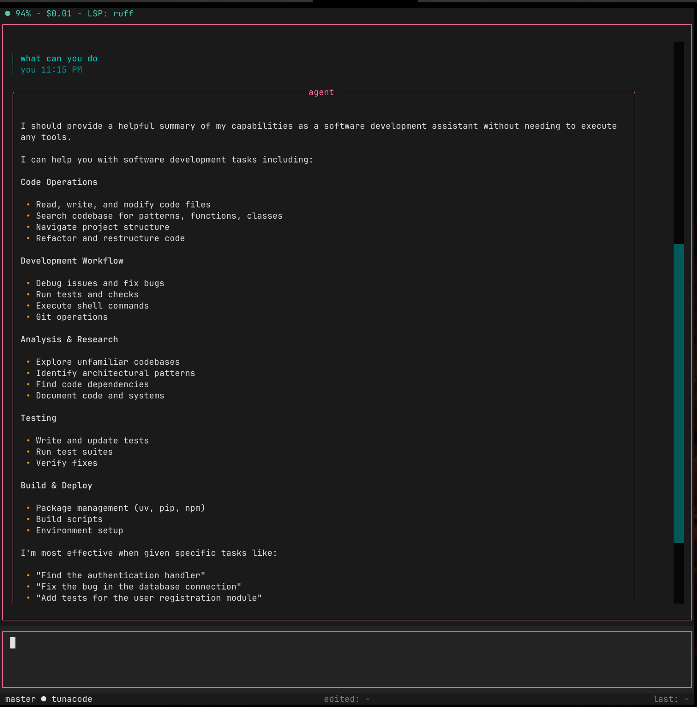
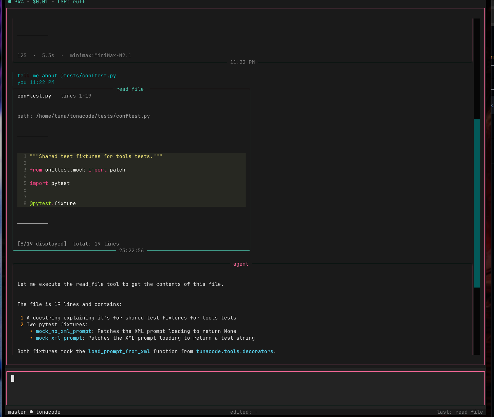

# tunacode-cli


[](https://badge.fury.io/py/tunacode-cli)
[](https://pepy.tech/project/tunacode-cli)
[](https://www.python.org/downloads/)
[](https://opensource.org/licenses/MIT)
[](https://discord.gg/TN7Fpynv6H)

A terminal-based AI coding agent with a NeXTSTEP-inspired interface.

> **Note:** Under active development - expect bugs.

## Features

- **Any model** - Works with any OpenAI-compatible API (Anthropic, OpenAI, Google, Ollama, vLLM, etc.)
- **File operations** - Read, write, update files with fuzzy matching for edits
- **Shell access** - Run bash commands with output capture
- **Code search** - Glob patterns and grep with ripgrep integration
- **Session persistence** - Resume previous conversations with `/resume`
- **LSP diagnostics** - Real-time code errors after file writes (Python, TypeScript, Go, Rust)
- **Themeable UI** - Multiple built-in themes

## Interface


*Agent response with NeXTSTEP-style panels*


*Tool output with syntax highlighting*

## Installation

```bash
uv tool install tunacode-cli
```

Or with pip:
```bash
pip install tunacode-cli
```

## Quick Start

```bash
# Configure API key
tunacode --setup

# Start coding
tunacode
```

## Configuration

Set your API key as an environment variable:

```bash
export ANTHROPIC_API_KEY="your-key"
# or
export OPENAI_API_KEY="your-key"
```

Config file: `~/.config/tunacode.json`

For local models and advanced settings, see the [Configuration Guide](docs/configuration/README.md).

## Commands

| Command | Description |
|---------|-------------|
| `/help` | Show available commands |
| `/model` | Change AI model |
| `/clear` | Clear UI state (messages preserved) |
| `/theme` | Change UI theme |
| `/resume` | Load previous sessions |
| `/update` | Check for updates |
| `!<cmd>` | Run shell command |
| `exit` | Quit |

## Tools

The agent has access to:

| Tool | Description |
|------|-------------|
| `read_file` | Read file contents with line ranges |
| `write_file` | Create new files |
| `update_file` | Edit existing files with fuzzy matching |
| `bash` | Execute shell commands |
| `glob` | Find files by pattern |
| `grep` | Search file contents |
| `list_dir` | List directory tree |
| `web_fetch` | Fetch web page content |

## LSP Integration

Automatic code diagnostics when LSP servers are in PATH:

| Language | Server |
|----------|--------|
| Python | `ruff server` |
| TypeScript/JS | `typescript-language-server` |
| Go | `gopls` |
| Rust | `rust-analyzer` |

## Security

TunaCode has **full shell access** with no permission prompts. If you're concerned:
- Use git so you can revert changes
- Run in a container/sandbox

## Discord

[](https://discord.gg/TN7Fpynv6H)

## License

MIT
