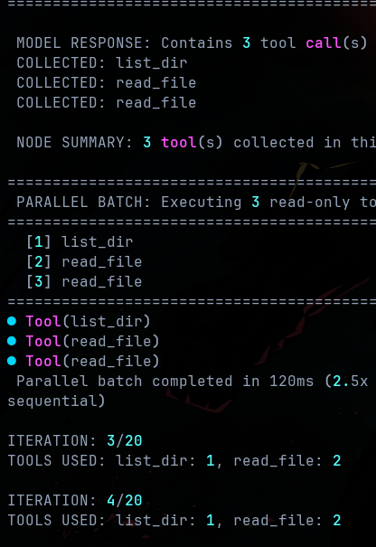

# TunaCode

<div align="center">

[](https://badge.fury.io/py/tunacode-cli)
[](https://pepy.tech/project/tunacode-cli)
[](https://www.python.org/downloads/)
[](https://opensource.org/licenses/MIT)

**AI-powered CLI coding assistant**


</div>

---

## Quick Install

```bash
# Option 1: One-line install (Linux/macOS)
wget -qO- https://raw.githubusercontent.com/alchemiststudiosDOTai/tunacode/master/scripts/install_linux.sh | bash

# Option 2: pip install
pip install tunacode-cli
```

## Configuration

Choose your AI provider and set your API key:

```bash
# OpenAI
tunacode --model "openai:gpt-4o" --key "sk-your-openai-key"

# Anthropic Claude  
tunacode --model "anthropic:claude-3.5-sonnet" --key "sk-ant-your-anthropic-key"

# OpenRouter (100+ models)
tunacode --model "openrouter:openai/gpt-4o" --key "sk-or-your-openrouter-key"
```

Your config is saved to `~/.config/tunacode.json` (edit directly with `nvim ~/.config/tunacode.json`)

### Recommended Models

Based on extensive testing, these models provide the best performance:
- `google/gemini-2.5-pro` - Excellent for complex reasoning
- `openai/gpt-4.1` - Strong general-purpose model
- `deepseek/deepseek-r1-0528` - Great for code generation
- `openai/gpt-4.1-mini` - Fast and cost-effective
- `anthropic/claude-4-sonnet-20250522` - Superior context handling

*Note: Formal evaluations coming soon. Any model can work, but these have shown the best results in practice.*

## Start Coding

```bash
tunacode
```

## Basic Commands

| Command | Description |
| ------- | ----------- |
| `/help` | Show all commands |
| `/model <provider:name>` | Switch model |
| `/clear` | Clear message history |
| `/compact` | Summarize conversation |
| `/branch <name>` | Create Git branch |
| `/yolo` | Skip confirmations |
| `!<command>` | Run shell command |
| `exit` | Exit TunaCode |

## Performance

TunaCode leverages parallel execution for read-only operations, achieving **3x faster** file operations:



Multiple file reads, directory listings, and searches execute concurrently using async I/O, making code exploration significantly faster.

## Features in Development

- **Streaming UI**: Currently working on implementing streaming responses for better user experience
- **Bug Fixes**: Actively addressing issues - please report any bugs you encounter!

*Note: While the tool is fully functional, we're focusing on stability and core features before optimizing for speed.*

## Safety First

⚠️ **Important**: TunaCode can modify your codebase. Always:
- Use Git branches before making changes
- Review file modifications before confirming
- Keep backups of important work

## Documentation

- [**Features**](docs/FEATURES.md) - All features, tools, and commands
- [**Advanced Configuration**](docs/ADVANCED-CONFIG.md) - Provider setup, MCP, customization
- [**Architecture**](docs/ARCHITECTURE.md) - Source code organization and design
- [**Development**](docs/DEVELOPMENT.md) - Contributing and development setup

## Links

- [PyPI Package](https://pypi.org/project/tunacode-cli/)
- [GitHub Repository](https://github.com/alchemiststudiosDOTai/tunacode)
- [Report Issues](https://github.com/alchemiststudiosDOTai/tunacode/issues)

---

MIT License - see [LICENSE](LICENSE) file