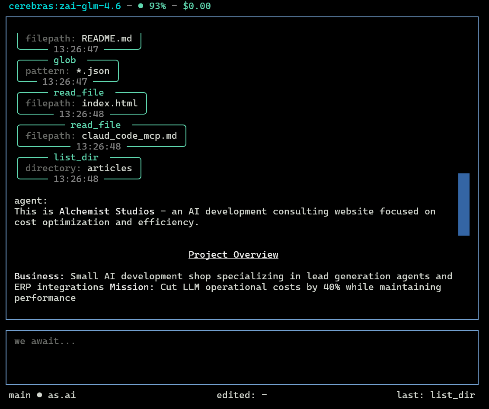
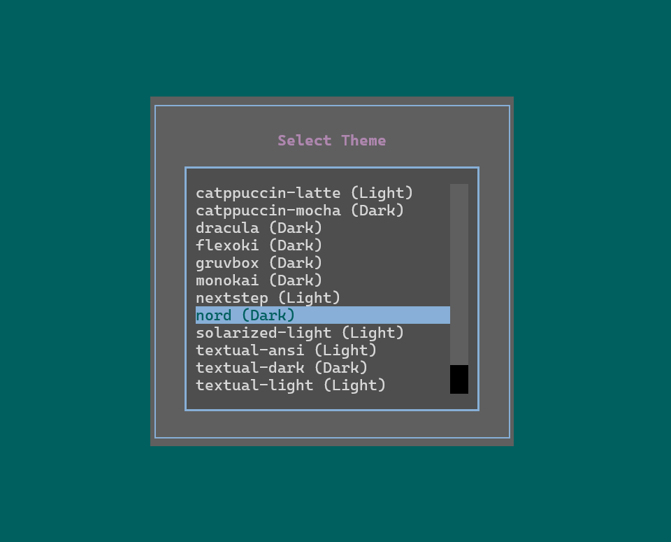
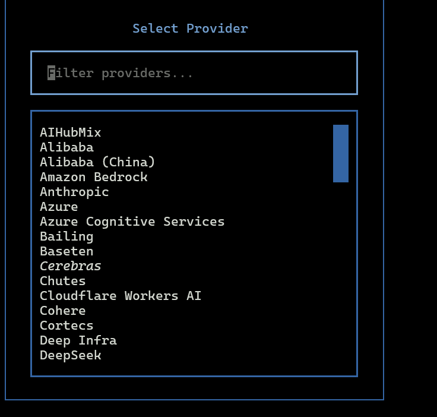

# tunacode-cli

A TUI code agent.

## Interface



The Textual-based terminal user interface provides a clean, interactive environment for AI-assisted coding.

## Theme Support

The interface supports multiple themes for different preferences and environments.



Customize the appearance with built-in themes or create your own color schemes.

## Model Setup

Configure your AI models and settings through the provided setup interface.



**Note:** TunaCode has full bash shell access. This tool assumes you know what you're doing. If you're concerned, run it in a sandboxed environment.

## v0.1.1 - Major Rewrite

This release is a complete rewrite with a new Textual-based TUI.

**Upgrading from v1?** The legacy v1 codebase is preserved in the `legacy-v1` branch and will only receive security updates.

## Requirements

- Python 3.11+

## Installation

```bash
uv tool install tunacode-cli
```

## Quick Start

1. Run the setup wizard to configure your API key:

```bash
tunacode --setup
```

2. Start coding:

```bash
tunacode
```

## Configuration

Set your API key as an environment variable or use the setup wizard:

```bash
export OPENAI_API_KEY="your-key"
# or
export ANTHROPIC_API_KEY="your-key"
```

Config file location: `~/.config/tunacode.json`

## Commands

| Command  | Description             |
| -------- | ----------------------- |
| /help    | Show available commands |
| /model   | Change AI model         |
| /clear   | Clear conversation      |
| /compact | Compress context        |
| exit     | Quit tunacode           |

## License

MIT
