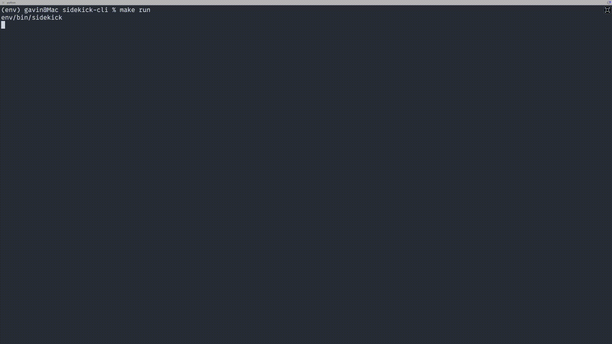

# TunaCode (Beta)

[](https://badge.fury.io/py/tunacode-cli)
[](https://www.python.org/downloads/)



Your agentic CLI developer.

## Overview

TunaCode is an agentic CLI-based AI tool inspired by Claude Code, Copilot, Windsurf and Cursor. It's meant
to be an open source alternative to these tools, providing a similar experience but with the flexibility of
using different LLM providers (Anthropic, OpenAI, Google Gemini, OpenRouter) while keeping the agentic workflow.

*TunaCode is currently in beta and under active development. Please [report issues](https://github.com/larock22/tunacode/issues) or share feedback!*

## Features

- No vendor lock-in. Use whichever LLM provider you prefer.
- MCP support
- Use /undo when AI breaks things.
- Easily switch between models in the same session.
- JIT-style system prompt injection ensures TunaCode doesn't lose the plot.
- Per-project guide. Adjust TunaCode's behavior to suit your needs.
- CLI-first design. Ditch the clunky IDE.
- Cost and token tracking.
- Per command or per session confirmation skipping.

## Upcoming Features

- **TinyAgent Integration**: Adding the [tinyagent framework](http://tinyagent.xyz/) to make this CLI tool truly agentic with multi-step reasoning and autonomous task execution
- **Advanced Flows**: Implementing sophisticated workflow patterns for complex development tasks
- **Quality of Life Updates**: Enhanced user experience with improved UI, better error handling, and streamlined interactions

## Quick Start

Install TunaCode.

```
pip install tunacode-cli
```

On first run, you'll be asked to configure your LLM providers.

```
tunacode
```

## Configuration

After initial setup, TunaCode saves a config file to `~/.config/tunacode.json`. You can open and
edit this file as needed. Future updates will make editing easier directly from within TunaCode.

### OpenRouter Support

To use [OpenRouter](https://openrouter.ai) models, add an `OPENROUTER_API_KEY` to the
`env` section of your configuration file. TunaCode will set the environment variable so the
OpenAI client can communicate with OpenRouter:

```json
{
  "env": {
    "OPENROUTER_API_KEY": "<YOUR_KEY>"
  }
}
```

Then run TunaCode with the OpenRouter base URL:

```bash
OPENAI_BASE_URL="https://openrouter.ai/api/v1" tunacode
```

You can now switch to OpenRouter models using:
```
/model openrouter:mistralai/devstral-small
/model openrouter:openai/gpt-4.1-mini
/model openrouter:codex-mini-latest
```

**Adding Custom OpenRouter Models**: You can use any OpenRouter model by editing your `~/.config/tunacode.json` file and adding the model to the configuration. TunaCode will automatically detect and use any model format `openrouter:provider/model-name`.

### MCP Support

TunaCode supports Model Context Protocol (MCP) servers. You can configure MCP servers in your `~/.config/tunacode.json` file:

```json
{
  "mcpServers": {
    "fetch": {
      "command": "uvx",
      "args": ["mcp-server-fetch"]
    },
    "github": {
      "command": "npx",
      "args": ["-y", "@modelcontextprotocol/server-github"],
      "env": {
        "GITHUB_PERSONAL_ACCESS_TOKEN": "<YOUR_TOKEN>"
      }
    }
  }
}
```

MCP servers extend the capabilities of your AI assistant, allowing it to interact with additional tools and data sources. Learn more about MCP at [modelcontextprotocol.io](https://modelcontextprotocol.io/).

### Available Commands

- `/help` - Show available commands
- `/yolo` - Toggle "yolo" mode (skip tool confirmations)
- `/clear` - Clear message history
- `/compact` - Summarize message history and clear old messages
- `/model` - List available models
- `/model <num>` - Switch to a specific model (by index)
- `/branch <name>` - Create and switch to a new Git branch
- `/undo` - Undo most recent changes
- `/dump` - Show current message history (for debugging)
- `exit` - Exit the application

## Customization

TunaCode supports the use of a "guide". This is a `TUNACODE.md` file in the project root that contains
instructions for TunaCode. Helpful for specifying tech stack, project structure, development
preferences etc.

## Requirements

- Python 3.10 or higher
- Git (for undo functionality)

## Installation

### Using pip

```bash
pip install tunacode-cli
```

### From Source

1. Clone the repository
2. Install dependencies: `pip install .` (or `pip install -e .` for development)

## Development

```bash
# Install development dependencies
make install

# Run linting
make lint

# Run tests
make test
```

## Release Process

When preparing a new release:

1. Update version numbers in:
   - `pyproject.toml`
   - `src/tunacode/constants.py` (APP_VERSION)

2. Commit the version changes:
   ```bash
   git add pyproject.toml src/tunacode/constants.py
   git commit -m "chore: bump version to X.Y.Z"
   ```

3. Create and push a tag:
   ```bash
   git tag vX.Y.Z
   git push origin vX.Y.Z
   ```

4. Create a GitHub release:
   ```bash
   gh release create vX.Y.Z --title "vX.Y.Z" --notes "Release notes here"
   ```

5. Merge to main branch and push to trigger PyPI release (automated)

### Commit Convention

This project follows the [Conventional Commits](https://www.conventionalcommits.org/) specification for commit messages:

- `feat:` - New features
- `fix:` - Bug fixes
- `docs:` - Documentation changes
- `style:` - Code style changes (formatting, etc.)
- `refactor:` - Code refactoring
- `perf:` - Performance improvements
- `test:` - Test additions or modifications
- `chore:` - Maintenance tasks (version bumps, etc.)
- `build:` - Build system changes
- `ci:` - CI configuration changes

## Links

- [PyPI Package](https://pypi.org/project/tunacode-cli/)
- [GitHub Issues](https://github.com/larock22/tunacode/issues)
- [GitHub Repository](https://github.com/larock22/tunacode)

## License

MIT

## Acknowledgments

This project is a fork of [sidekick-cli](https://github.com/geekforbrains/sidekick-cli). Thank you to the sidekick-cli team for creating the foundation that made TunaCode possible! 🙏
