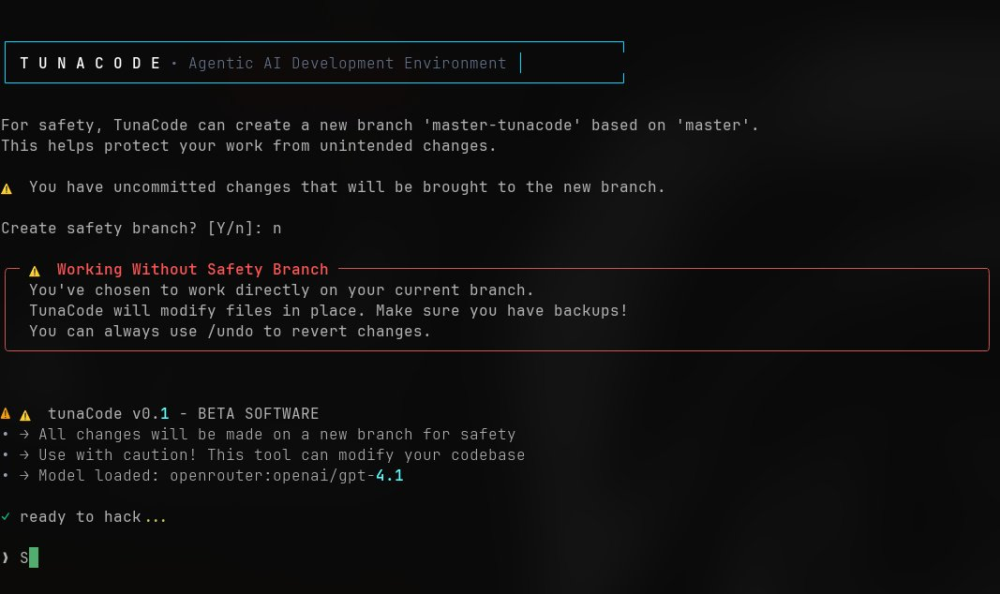

# 🐟 TunaCode

[](https://badge.fury.io/py/tunacode-cli)
[](https://www.python.org/downloads/)
[](https://opensource.org/licenses/MIT)



**Your agentic CLI developer** - An open-source alternative to Claude Code, Copilot, and Cursor with multi-provider LLM support.


## ✨ What's New (v0.1.0)

- 🚀 **60% faster startup** with lazy loading and optimizations
- 🤖 **TinyAgent integration** for robust ReAct-based interactions
- 🛡️ **Three-layer undo system** with automatic failover
- 📊 **Enhanced model selection** with fuzzy matching and cost indicators
- 📁 **Project-local backups** in `.tunacode/` directory

## 🎯 Features

### Core Capabilities
- **🔓 No vendor lock-in** - Use any LLM provider (OpenAI, Anthropic, Google, 100+ via OpenRouter)
- **⚡ Fast & responsive** - Optimized for speed with <5ms operation overhead
- **🛡️ Safe operations** - Three-layer undo system ensures nothing is lost
- **🎨 Modern CLI** - Beautiful terminal UI with syntax highlighting
- **💰 Cost tracking** - Monitor tokens and costs per session

### Developer Experience
- **🔄 Hot model switching** - Change models mid-conversation with `/model`
- **📝 Project guides** - Customize behavior with `TUNACODE.md` files
- **🚀 YOLO mode** - Skip confirmations when you're confident
- **🔧 MCP support** - Extend with Model Context Protocol servers
- **📊 Git integration** - Automatic branch creation and undo support

## 🚀 Quick Start

### One-Line Install (Linux/macOS)

```bash
# Using curl
curl -sSL https://raw.githubusercontent.com/alchemiststudiosDOTai/tunacode/master/scripts/install_linux.sh | bash

# Or using wget
wget -qO- https://raw.githubusercontent.com/alchemiststudiosDOTai/tunacode/master/scripts/install_linux.sh | bash
```

This creates a virtual environment in `~/.tunacode-venv` and adds the `tunacode` command to your PATH.

### Alternative Install Methods

```bash
# Install from PyPI
pip install tunacode-cli

# Or install globally using pipx (recommended)
python3 -m pip install --user pipx
python3 -m pipx ensurepath
pipx install tunacode-cli
```

### Start Using TunaCode

```bash
# Run setup (first time only)
tunacode

# Start coding!
tunacode
> Help me refactor this codebase to use async/await

# Update to latest version
tunacode --update

# Start with a specific model
tunacode --model openrouter:openai/gpt-4o-mini

# Use a custom OpenAI-compatible API endpoint
tunacode --base-url https://your-api.com/v1 --model custom:gpt-4
```

## 📋 Commands

| Command | Description | Example |
|---------|-------------|---------|
| `/model` or `/m` | List and switch models | `/model 3` or `/m opus` |
| `/yolo` | Toggle confirmation skipping | `/yolo` |
| `/undo` | Undo last file operation | `/undo` |
| `/clear` | Clear conversation history | `/clear` |
| `/branch <name>` | Create new git branch | `/branch feature/auth` |
| `/compact` | Summarize and trim history | `/compact` |
| `/help` | Show all commands | `/help` |
| `--update` | Update to latest version | `tunacode --update` |

## 🔧 Configuration

Configuration is stored in `~/.config/tunacode.json`:

```json
{
  "default_model": "openai:gpt-4o",
  "env": {
    "OPENAI_API_KEY": "sk-...",
    "ANTHROPIC_API_KEY": "sk-ant-...",
    "OPENROUTER_API_KEY": "sk-or-..."
  },
  "mcpServers": {
    "github": {
      "command": "npx",
      "args": ["-y", "@modelcontextprotocol/server-github"],
      "env": {"GITHUB_PERSONAL_ACCESS_TOKEN": "..."}
    }
  }
}
```

### Environment Variables

TunaCode automatically loads environment variables from a `.env` file in your current directory:

```bash
# .env file
OPENAI_API_KEY=sk-...
OPENROUTER_API_KEY=sk-or-v1-...
ANTHROPIC_API_KEY=sk-ant-...
```

Environment variables take precedence over config file values.

### TinyAgent Configuration

TunaCode uses [TinyAgent](https://github.com/alchemiststudiosDOTai/tiny_agent_os) under the hood. Advanced configuration is stored in `~/.config/tunacode_config.yml`:

```yaml
# Model and API configuration
base_url: ${OPENAI_BASE_URL:-https://api.openai.com/v1}
model:
  default: "gpt-4o"  # Overridden by TunaCode's model selection

# File operations
file_operations:
  max_file_size: 10_485_760  # 10 MB
  allow_overwrite: true

# Retry configuration
retries:
  max_attempts: 3
  temperature: { initial: 0.2, increment: 0.3, max: 0.8 }
```

This file is automatically created during installation. Most users won't need to modify it.

### Using OpenRouter (100+ Models)

```bash
# Add your OpenRouter API key to config or .env file
# TunaCode automatically sets the correct base URL for OpenRouter models

# Use any OpenRouter model:
tunacode --model openrouter:openai/gpt-4o-mini
tunacode --model openrouter:anthropic/claude-3.5-sonnet

# Or switch models inside TunaCode:
/model openrouter:anthropic/claude-3-opus
/model openrouter:mistralai/devstral-small
/model openrouter:openai/gpt-4.1
```

### OpenAI-Compatible APIs

TunaCode supports any OpenAI-compatible API endpoint. The `--base-url` flag overrides the API endpoint for providers that use the OpenAI API format:

```bash
# Use a local LLM server
tunacode --base-url http://localhost:8080/v1 --model local:llama2

# Use alternative OpenAI-compatible services
tunacode --base-url https://api.together.ai/v1 --model together:llama-2-70b
```

**Note**: The base URL override only works with OpenAI-compatible APIs that follow the same request/response format as OpenAI's API.

## 🛡️ Undo System

TunaCode provides **three layers of protection** for your files:

1. **Git commits** - Primary undo mechanism (if available)
2. **Operation log** - Tracks changes with content (<100KB files)
3. **File backups** - Physical copies in `.tunacode/backups/`

All undo data is stored locally in your project:

```
your-project/
└── .tunacode/          # Auto-created, gitignored
    ├── backups/        # Timestamped file copies
    ├── operations.jsonl # Change history
    └── README.md       # Explains the directory
```

## 🎯 Project Customization

Create a `TUNACODE.md` file in your project root:

```markdown
# Project Guidelines for TunaCode

## Tech Stack
- Next.js 14 with App Router
- TypeScript with strict mode
- Tailwind CSS for styling

## Conventions
- Use arrow functions for components
- Prefer server components where possible
- Follow conventional commits

## Commands
- `npm run dev` - Start development
- `npm test` - Run tests
```

## ⚡ Performance

TunaCode is optimized for speed:
- **Startup time**: ~0.5-0.8 seconds
- **Model switching**: ~100ms  
- **File operations**: ~5ms overhead
- **API calls**: Connection pooling enabled

## 🔧 Advanced Usage

### Environment Variables
```bash
# Use different base URLs
OPENAI_BASE_URL="https://openrouter.ai/api/v1" tunacode

# Disable undo system
TUNACODE_NO_UNDO=1 tunacode

# Set default model
TUNACODE_MODEL="anthropic:claude-3-opus" tunacode
```

### MCP Servers
Extend TunaCode with Model Context Protocol servers for web fetching, database access, and more. See [modelcontextprotocol.io](https://modelcontextprotocol.io/) for available servers.

## 🤝 Contributing

We welcome contributions! Please see our [Contributing Guide](CONTRIBUTING.md) for details.

```bash
# Setup development environment
git clone https://github.com/larock22/tunacode
cd tunacode
pip install -e ".[dev]"

# Run tests
make test

# Lint code
make lint
```

## 📚 Documentation

- [Architecture Overview](docs/architecture.md)
- [API Integration](API_CALL_FLOW.md)
- [Undo System Design](UNDO_SYSTEM_DESIGN.md)
- [Performance Guide](PERFORMANCE_OPTIMIZATIONS.md)

## 🙏 Acknowledgments

TunaCode is built on the foundation of [sidekick-cli](https://github.com/geekforbrains/sidekick-cli). Special thanks to:
- The sidekick-cli team for the original codebase
- [TinyAgent](https://github.com/alchemiststudiosDOTai/tinyAgent) for the robust agent framework
- The open-source community for feedback and contributions

## 📄 License

MIT License - see [LICENSE](LICENSE) for details.

---

**Note**: TunaCode is in active development. Please [report issues](https://github.com/larock22/tunacode/issues) or share feedback!