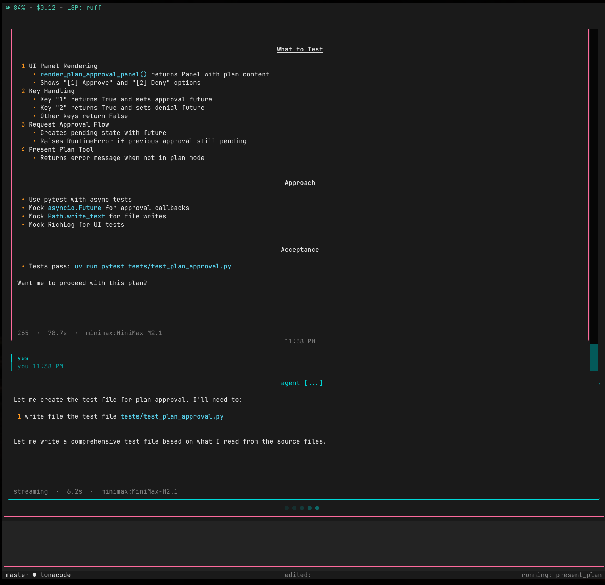

# tunacode-cli


[](https://badge.fury.io/py/tunacode-cli)
[](https://pepy.tech/project/tunacode-cli)
[](https://www.python.org/downloads/)
[](https://opensource.org/licenses/MIT)
[](https://discord.gg/TN7Fpynv6H)

A TUI code agent.

> **Note:** Under active development - expect bugs.


## Interface

The Textual-based terminal user interface provides a clean, interactive environment for AI-assisted coding, with a design heavily inspired by the classic NeXTSTEP user interface.


*Agent response panel with formatted output*


*Tool rendering with syntax highlighting*


*Structured plan approval workflow*

## Theme Support

The interface supports multiple themes for different preferences and environments.

Customize the appearance with built-in themes or create your own color schemes.

## Model Setup

Configure your AI models and settings through the provided setup interface.

**Note:** TunaCode has full bash shell access. This tool assumes you know what you're doing. If you're concerned, run it in a sandboxed environment.

## v0.1.35 - Major Rewrite

This release is a complete rewrite with a new Textual-based TUI.

**Upgrading from v1?** The legacy v1 codebase is preserved in the `legacy-v1` branch and will only receive security updates.

## Requirements

- Python 3.11+

## Installation

```bash
uv tool install tunacode-cli
```

## Quick Start

1. Run the setup wizard to configure your API key:

```bash
tunacode --setup
```

2. Start coding:

```bash
tunacode
```

## Configuration

Set your API key as an environment variable or use the setup wizard:

```bash
export OPENAI_API_KEY="your-key"
# or
export ANTHROPIC_API_KEY="your-key"
```

Config file location: `~/.config/tunacode.json`

For advanced settings including **local mode** for small context models, see the [Configuration Guide](docs/configuration/README.md).

## Commands

| Command  | Description                  |
| -------- | ---------------------------- |
| /help    | Show available commands      |
| /model   | Change AI model              |
| /clear   | Clear agent state (UI, thoughts) - messages preserved for /resume |
| /theme   | Change UI theme              |
| /resume  | Load/delete saved sessions   |
| !<cmd>   | Run shell command            |
| exit     | Quit tunacode                |

## LSP Integration (Beta)

TunaCode includes experimental Language Server Protocol support for real-time diagnostics. When an LSP server is detected in your PATH, it activates automatically.

**Supported languages:**
| Language   | LSP Server                    |
| ---------- | ----------------------------- |
| Python     | `ruff server`                 |
| TypeScript | `typescript-language-server`  |
| JavaScript | `typescript-language-server`  |
| Go         | `gopls`                       |
| Rust       | `rust-analyzer`               |

Diagnostics appear in the UI when editing files. This feature is beta - expect rough edges.

## Discord Server

Join our official discord server to receive help, show us how you're using tunacode, and chat about anything LLM.

[](https://discord.gg/TN7Fpynv6H)

## License

MIT
