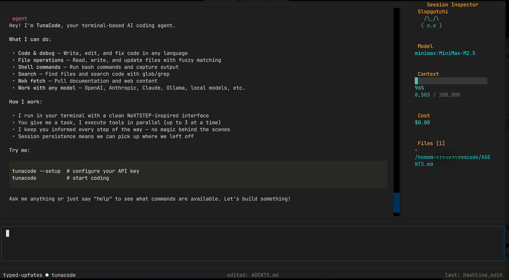
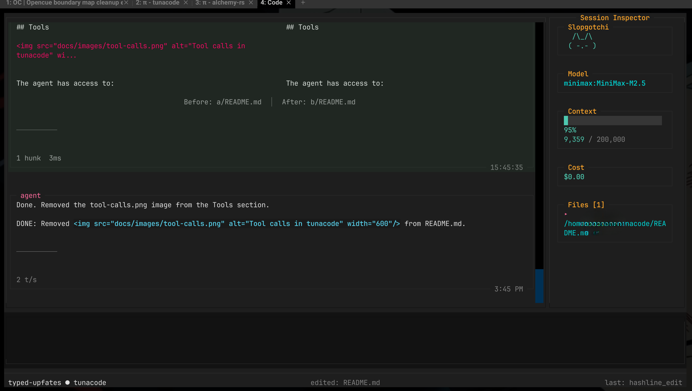

# tunacode-cli



[](https://badge.fury.io/py/tunacode-cli)
[](https://pepy.tech/project/tunacode-cli)
[](https://www.python.org/downloads/)
[](https://opensource.org/licenses/MIT)
[](https://discord.gg/TN7Fpynv6H)

A terminal-based AI coding agent with a NeXTSTEP-inspired interface.

> **Early stage software — not production ready.** Under active development, expect bugs and breaking changes.

## Features

- **Any model** - Works with any OpenAI-compatible API (Anthropic, OpenAI, Google, Ollama, vLLM, etc.)
- **Native tinyagent tools** - Direct tinyagent tool contracts with no legacy wrapper compatibility layer
- **File operations** - Read files with hash-tagged lines, create files, and edit existing files with hash-validated references
- **Shell access** - Run bash commands with output capture
- **Repository discovery** - Use `discover` for natural-language code search and repository exploration
- **Session persistence** - Resume previous conversations with `/resume`
- **LSP diagnostics** - Real-time code errors after file writes (Python, TypeScript, Go, Rust)
- **Themeable UI** - CSS-based theming with NeXTSTEP-inspired design
- **Text selection + clipboard copy** - Mouse selection works across Rich-rendered chat content; copy with `ctrl+y` or `ctrl+shift+c`
- **Agent loop** - Powered by [tinyAgent](https://github.com/alchemiststudiosDOTai/tinyAgent)

## Built With

- **[tinyAgent](https://github.com/alchemiststudiosDOTai/tinyAgent)** - Core agent loop handling LLM interaction and tool execution
- **[alchemy-rs](https://github.com/tunahorse/alchemy-rs)** - Rust-powered tokenizer and utilities via PyO3 bindings
- **Textual** - Terminal UI framework with CSS-based styling
- **Rich** - Terminal rendering with syntax highlighting
- **Typer** - CLI framework


## Installation

### End Users

```bash
uv tool install tunacode-cli
```

Or with pip:
```bash
pip install tunacode-cli
```

### Developers (Fresh Clone)

```bash
git clone https://github.com/alchemiststudiosDOTai/tunacode.git
cd tunacode
make install
```

Or without make:
```bash
git clone https://github.com/alchemiststudiosDOTai/tunacode.git
cd tunacode
./scripts/dev-setup.sh
```

## Development

Common development tasks:

```bash
make install    # Cleanly bootstrap the verified dev environment
make dev-setup  # Alias for make install
make run        # Run the development server
make test       # Run test suite
make lint       # Run linters
make clean      # Clean build artifacts
```

View technical debt:

```bash
uv run python scripts/todo_scanner.py --format text
```

## Quick Start

```bash
# Configure API key
tunacode --setup

# Start coding
tunacode
```

## Configuration

Set your API key as an environment variable:

```bash
export ANTHROPIC_API_KEY="your-key"
# or
export OPENAI_API_KEY="your-key"
```

Config file: `~/.config/tunacode.json`

TunaCode deep-merges partial config files onto built-in defaults and validates the merged result at startup. If the file is malformed, the app reports a configuration error instead of silently guessing.

For local models and advanced settings, see the [Configuration Guide](docs/configuration/README.md).

## Commands


Slash commands are command objects in `tunacode.ui.commands`; each one is a `Command` subclass and is registered in `COMMANDS`. `handle_command()` also routes shell commands (`!<cmd>`), legacy `exit`, and slash `/exit`.
| Command | Description |
|---------|-------------|
| `/cancel` | Cancel the current request or shell command. |
| `/help` | Show available commands |
| `/clear` | Clear transient agent state while preserving message history. |
| `/compact` | Force context compaction |
| `/debug` | Toggle debug logging to screen (includes parallel tool-call lifecycle lines) |
| `/model` | Open model picker or switch model |
| `/resume` | List, load, or delete persisted sessions. |
| `/skills` | Browse, search, or load session skills. |
| `/theme` | Open theme picker or switch theme |
| `/thoughts` | Toggle the streaming thought panel. |
| `/update` | Check for or install updates. |
| `!<cmd>` | Run shell command |
| `/exit` | Exit TunaCode |
| `exit` | Legacy alias for exit |

### Confirm Parallel Tool Calls

Run `/debug` to enable lifecycle logs. During agent execution, parallel batches are reported with lines prefixed by:

- `[LIFECYCLE] Parallel tool calls active: ...`
- `[LIFECYCLE] Parallel tool calls update: ...`
- `[LIFECYCLE] Parallel tool calls complete`

If no `Parallel tool calls` lifecycle lines appear, that request did not execute a parallel tool batch.
## Tools

The agent has access to:

| Tool | Description |
|------|-------------|
| `bash` | Execute shell commands |
| `discover` | Search and explore the repository with a natural-language query |
| `read_file` | Read file contents with content-hash tagged lines |
| `hashline_edit` | Edit existing files using hash-validated line references from `read_file` |
| `web_fetch` | Fetch web page content |
| `write_file` | Create new files |

TunaCode now uses the native tinyagent tool surface directly. Legacy wrapper-based tools such as `update_file`, `glob`, `grep`, and `list_dir` are removed rather than translated through a compatibility layer.

Important tool rules:

- `bash` accepts optional `cwd`, `env`, `timeout`, and `capture_output` arguments in addition to the required `command`.
- `discover` is the semantic repository mapper; use it to find code related to a concept or feature instead of manually chaining search tools.
- `read_file` supports paging with `offset` and `limit`, wraps results in `<file>...</file>`, and each read replaces the editable cache window for that file.
- `hashline_edit` only supports `replace`, `replace_range`, and `insert_after` using `<line>:<hash>` refs from the current `read_file` output.
- `write_file` is create-only: it creates missing parent directories but refuses to overwrite an existing file.
- `web_fetch` only fetches public `http` or `https` URLs and blocks localhost, private, and reserved addresses.



## LSP Integration

Automatic code diagnostics when LSP servers are in PATH:

| Language | Server |
|----------|--------|
| Python | `ruff server` |
| TypeScript/JS | `typescript-language-server` |
| Go | `gopls` |
| Rust | `rust-analyzer` |

## Security

TunaCode has **full shell access** with no permission prompts. If you're concerned:
- Use git so you can revert changes
- Run in a container/sandbox

## Discord

[](https://discord.gg/TN7Fpynv6H)

## License

MIT
