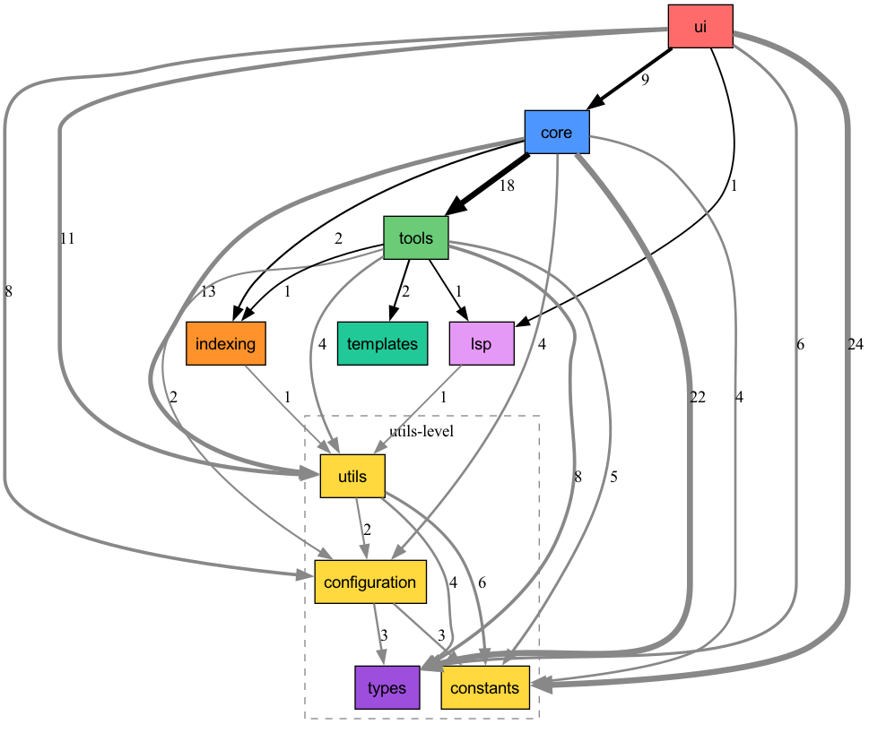

# Dependency Map

> **Baseline frozen: 2026-01-26**
> Generated with [grimp](https://github.com/python-grimp/grimp)

## Layer Hierarchy (high to low)

```
ui          → outer layer (TUI)
core        → business logic
tools       → agent tools
indexing    → code indexing infrastructure
lsp         → language server protocol
templates   → prompt templates
─────────────────────────────────
utils       ┐
types       │ utils-level (importable from anywhere)
configuration│
constants   ┘
```

## Current State



### Import Counts (grimp)

| From | To | Count | Status |
|------|----|-------|--------|
| ui → core | 9 | ✅ valid |
| ui → utils-level | 49 | ✅ valid |
| core → tools | 18 | ✅ valid |
| core → indexing | 2 | ✅ valid |
| core → utils-level | 43 | ✅ valid |
| tools → indexing | 1 | ✅ valid |
| tools → lsp | 1 | ✅ valid |
| tools → templates | 2 | ✅ valid |
| tools → utils-level | 19 | ✅ valid |
| indexing → utils | 1 | ✅ valid |
| lsp → utils | 1 | ✅ valid |

### Violations

**None.** All dependencies flow in valid directions.

## Rules

1. **Outward flow**: ui → core → tools → infrastructure
2. **Utils-level**: `utils/`, `types/`, `configuration/`, `constants.py` can be imported from any layer
3. **No backward imports**: tools cannot import from core, core cannot import from ui

## Verification

```bash
uv run python -c "
import grimp
g = grimp.build_graph('tunacode')
layers = (
    grimp.Layer('ui'),
    grimp.Layer('core'),
    grimp.Layer('tools'),
    grimp.Layer('indexing'),
    grimp.Layer('lsp'),
    grimp.Layer('templates'),
    grimp.Layer('utils'),
    grimp.Layer('configuration'),
    grimp.Layer('types'),
)
violations = g.find_illegal_dependencies_for_layers(layers=layers, containers={'tunacode'})
print('Violations:', len(violations))
for v in violations:
    print(f'  {v.importer} -> {v.imported}')
"
```

## UI Layer Detail

Starting point for clean mapping. The UI layer imports:

- **core (9)**: Agent orchestration, state management
- **configuration (8)**: Model configs, settings
- **constants (24)**: UI constants, limits
- **utils (11)**: Formatting, system utilities
- **types (6)**: Type definitions
- **lsp (1)**: Language server integration

No tools imports. UI delegates all tool execution to core.
