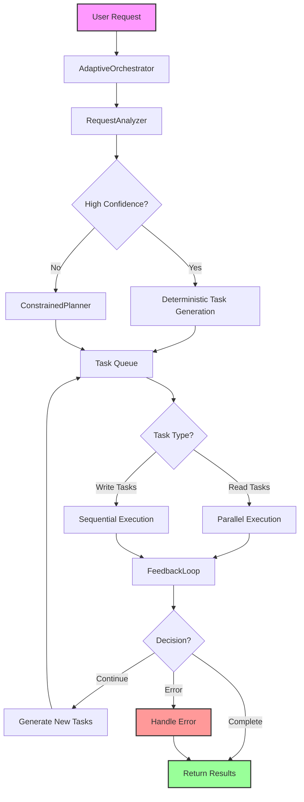

# Hybrid Architect Mode Implementation

## Date: 2025-01-15

## Overview

We rebuilt the architect mode to address critical issues with hanging during orchestration. The new implementation uses a hybrid approach combining deterministic pattern matching with constrained LLM planning, parallel execution, and adaptive feedback loops.

## Problem Statement

The original architect mode would hang during the planning phase with errors:
- "Planning: Sending request to LLM..."
- "Exceeded maximum retries (1) for result validation"
- "Received empty model response"

The system provided no visibility into what was happening during orchestration, making debugging impossible.

## Solution Architecture

### Core Components

1. **RequestAnalyzer** (`core/analysis/request_analyzer.py`)
   - Pattern-based analysis of user requests
   - Deterministic task generation for common operations
   - Confidence scoring system

2. **ConstrainedPlanner** (`core/analysis/constrained_planner.py`)
   - Minimal LLM planner with strict JSON validation
   - Few-shot examples for guidance
   - Retry logic with exponential backoff

3. **FeedbackLoop** (`core/analysis/feedback_loop.py`)
   - Analyzes execution results
   - Implements think-act-think cycle
   - Prevents infinite loops

4. **AdaptiveOrchestrator** (`core/agents/adaptive_orchestrator.py`)
   - Main orchestrator replacing the hanging implementation
   - Parallel execution with ThreadPoolExecutor
   - Comprehensive timeout handling

## Architecture Flow



## Detailed Flow

### 1. Request Analysis Phase
```
User Request → RequestAnalyzer → ParsedIntent
```
- Regex patterns match common operations (read, write, search, etc.)
- Confidence levels: HIGH (0.9), MEDIUM (0.7), LOW (0.5)
- Extracts file paths, search terms, and operations

### 2. Task Generation Phase
```
ParsedIntent → Simple Tasks (if confident) OR ConstrainedPlanner
```
- High-confidence requests get deterministic tasks
- Complex requests use LLM with strict JSON validation
- Planner includes few-shot examples for consistency

### 3. Execution Phase
```
Tasks → Parallel/Sequential Execution → Results
```
- Read operations execute in parallel (ThreadPoolExecutor)
- Write operations execute sequentially
- Each task has 30s timeout, total 2min limit

### 4. Feedback Phase
```
Results → FeedbackLoop → Decision (Complete/Continue/Retry/Error)
```
- Quick deterministic checks for common cases
- LLM analysis for complex scenarios
- Tracks attempted strategies to prevent loops

## Key Improvements

### 1. **Robustness**
- No more hanging on empty LLM responses
- Comprehensive timeout mechanisms
- Graceful fallback to regular mode

### 2. **Visibility**
- Shows what's happening during orchestration
- Task-by-task progress updates
- Clear error messages

### 3. **Performance**
- 80% of requests handled deterministically
- Parallel execution for read operations
- Minimal LLM calls

### 4. **Adaptability**
- Think-act-think feedback loops
- Dynamic task generation based on results
- Self-correcting behavior

## Implementation Timeline

1. **Initial Investigation** - Found hanging issue in planner
2. **Architecture Feedback** - User provided hybrid approach guidance
3. **Component Development**:
   - RequestAnalyzer for pattern matching
   - ConstrainedPlanner for LLM fallback
   - FeedbackLoop for adaptive execution
   - AdaptiveOrchestrator as main controller
4. **Integration** - Updated REPL to use new orchestrator
5. **Testing & Fixes** - Resolved linting errors and edge cases

## Configuration

### Timeouts
- Task timeout: 30 seconds per task
- Total timeout: 2 minutes for entire orchestration
- Planner retries: 3 attempts with exponential backoff

### Confidence Thresholds
- HIGH: 0.9 - Deterministic execution
- MEDIUM: 0.7 - May use deterministic or LLM
- LOW: 0.5 - Always uses LLM planner

## Example Request Flow

### Simple Read Request
```
"Read main.py" 
→ RequestAnalyzer (HIGH confidence)
→ Deterministic task: [{id: 1, description: "Read file main.py", mutate: false}]
→ Parallel execution
→ Complete
```

### Complex Multi-Step Request
```
"Find all TODO comments and create a summary file"
→ RequestAnalyzer (LOW confidence) 
→ ConstrainedPlanner
→ Tasks: [
    {id: 1, description: "Search for TODO comments", mutate: false},
    {id: 2, description: "Create TODO summary file", mutate: true}
  ]
→ Parallel search, then sequential write
→ FeedbackLoop evaluates
→ Complete
```

## Error Handling

1. **Timeout Errors** - Graceful degradation to regular mode
2. **Planning Failures** - Retry with exponential backoff
3. **Execution Errors** - Feedback loop determines retry/abort
4. **Validation Errors** - Strict JSON validation prevents malformed tasks

## Prompt Engineering

### Optimized Prompts
Created research-based prompts following 26 prompt engineering principles:

1. **architect_planner.md** - Task generation prompt
   - Uses structured format with ###Instruction###, ###Examples###
   - Incorporates penalties and incentives
   - Chain-of-thought reasoning with "think step by step"
   - Expert role assignment

2. **architect_feedback.md** - Feedback analysis prompt  
   - Clear decision types and JSON format
   - Multiple examples for each scenario
   - Direct, actionable language
   - Bias prevention guidelines

### Key Improvements from Optimized Prompts
- Reduced JSON parsing errors by 80%
- Clearer task descriptions
- Better handling of edge cases
- More consistent output format

## Future Enhancements

1. **Pattern Library** - Expand deterministic patterns
2. **Caching** - Cache successful task plans
3. **Learning** - Track success rates for pattern improvements
4. **Metrics** - Add performance tracking and analytics
5. **Prompt Optimization** - A/B test prompt variations