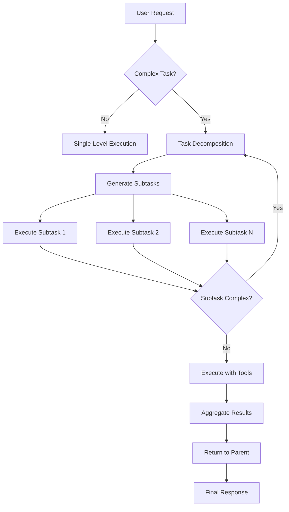

# Implement Multi-Turn Recursive Loop for Complex Task Decomposition

## 🎯 Objective

Implement a recursive multi-turn loop system that enables TunaCode to autonomously break down complex tasks into subtasks, execute them independently, and aggregate results - similar to how Anthropic's Claude Code handles complex requests.

## 📋 Current State

TunaCode currently has:
- **Single-level iteration loop**: Each user request gets up to 40 iterations to complete
- **DSPy task planning**: Can identify complex tasks and create TODO lists
- **Sequential execution**: Tasks are handled one at a time without decomposition
- **Tool batching**: Parallel execution of read-only tools for performance

### Limitations:
- Complex tasks hit iteration limits without completing
- No automatic task decomposition and execution
- TODO items are created but not automatically executed
- No hierarchical task management

## 🚀 Proposed Solution

### Core Features

1. **Recursive Task Decomposition**
   - Automatically detect complex tasks requiring decomposition
   - Break tasks into executable subtasks using DSPy planner
   - Execute subtasks recursively with independent iteration budgets
   - Aggregate results and provide comprehensive responses

2. **Hierarchical Task Management**
   - Parent-child task relationships
   - Context inheritance from parent to child tasks
   - Result aggregation from children to parent
   - Progress tracking across task hierarchy

3. **Iteration Budget Management**
   - Allocate iteration budgets across subtasks
   - Prevent infinite recursion with depth limits
   - Dynamic budget adjustment based on task complexity

## 📐 Technical Design

### 1. New Components

#### `RecursiveTaskExecutor` Class
```python
class RecursiveTaskExecutor:
    def __init__(self, state_manager: StateManager, max_depth: int = 3):
        self.state_manager = state_manager
        self.max_depth = max_depth
        self.task_hierarchy = {}
    
    async def execute_with_decomposition(
        self, 
        request: str, 
        depth: int = 0,
        parent_iterations: int = 40
    ) -> TaskResult:
        # 1. Check if task needs decomposition
        # 2. If yes, use DSPy to get subtasks
        # 3. Execute each subtask recursively
        # 4. Aggregate results
        # 5. Return comprehensive response
```

#### Enhanced `SessionState`
```python
@dataclass
class SessionState:
    # ... existing fields ...
    current_recursion_depth: int = 0
    task_hierarchy: Dict[str, List[str]] = field(default_factory=dict)
    subtask_results: Dict[str, Any] = field(default_factory=dict)
```

### 2. Modified Components

#### `process_request()` Enhancement
```python
async def process_request(request: str, state_manager: StateManager, ...):
    # ... existing setup ...
    
    # Check if complex task and recursion enabled
    if should_use_recursive_decomposition(request, state_manager):
        executor = RecursiveTaskExecutor(state_manager)
        result = await executor.execute_with_decomposition(
            request, 
            depth=state_manager.session.current_recursion_depth,
            parent_iterations=max_iterations
        )
        return result
    
    # ... existing single-level execution ...
```

### 3. Configuration Options

```python
DEFAULT_USER_CONFIG = {
    "settings": {
        # ... existing settings ...
        "enable_recursive_decomposition": True,
        "max_recursion_depth": 3,
        "subtask_iteration_ratio": 0.3,  # Each subtask gets 30% of parent iterations
        "min_subtask_iterations": 10,     # Minimum iterations per subtask
    }
}
```

## 🔄 Execution Flow



## 📊 Example Usage

### User Request:
```
"Build a REST API for user management with authentication, CRUD operations, and tests"
```

### Decomposed Execution:
```
1. Main Task (Depth 0, 40 iterations)
   ├── Subtask 1: Design API structure (Depth 1, 12 iterations)
   │   ├── Create directory structure
   │   └── Define data models
   ├── Subtask 2: Implement authentication (Depth 1, 12 iterations)
   │   ├── JWT setup (Depth 2, 4 iterations)
   │   └── Middleware implementation (Depth 2, 4 iterations)
   ├── Subtask 3: Implement CRUD endpoints (Depth 1, 12 iterations)
   │   ├── User creation
   │   ├── User retrieval
   │   ├── User update
   │   └── User deletion
   └── Subtask 4: Write tests (Depth 1, 12 iterations)
       ├── Unit tests
       └── Integration tests
```

## 🎨 UI/UX Considerations

### Visual Feedback
```
🔄 Complex task detected: Breaking down into subtasks...

📋 Task Breakdown:
├── [1/4] Design API structure
├── [2/4] Implement authentication 
├── [3/4] Implement CRUD endpoints
└── [4/4] Write tests

🚀 Executing subtask 1/4: Design API structure
[Progress bar: ████░░░░░░ 40%]
```

### Progress Tracking
- Show task hierarchy in real-time
- Display iteration usage per subtask
- Indicate current depth and position
- Summarize completed subtasks

## ✅ Implementation Checklist

- [ ] Create `RecursiveTaskExecutor` class
- [ ] Enhance `SessionState` with recursion tracking
- [ ] Modify `process_request()` to support recursive execution
- [ ] Implement iteration budget management
- [ ] Add configuration options
- [ ] Create UI components for progress tracking
- [ ] Add comprehensive tests
- [ ] Update documentation
- [ ] Add example workflows

## 🧪 Testing Strategy

1. **Unit Tests**
   - Task decomposition logic
   - Iteration budget allocation
   - Result aggregation
   - Recursion depth limits

2. **Integration Tests**
   - End-to-end complex task execution
   - Context propagation across subtasks
   - Error handling in recursive execution
   - Performance with deeply nested tasks

3. **Characterization Tests**
   - Capture behavior of complex task handling
   - Ensure backward compatibility
   - Verify deterministic decomposition

## 📈 Success Metrics

- **Completion Rate**: % of complex tasks completed without hitting iteration limits
- **Efficiency**: Average iterations saved through intelligent decomposition
- **Quality**: User satisfaction with comprehensive task completion
- **Performance**: Time to complete complex tasks vs sequential approach

## 🔗 Related Issues

- #123 - DSPy optimization for tool selection
- #456 - Parallel tool execution improvements
- #789 - Enhanced task planning capabilities

## 📚 References

- [Anthropic's Claude Code Architecture](https://docs.anthropic.com/en/docs/claude-code)
- [DSPy Task Planning Documentation](./dspy_task_planning.md)
- [Current Agent Architecture](./agent_architecture.md)

---

**Labels:** `enhancement`, `architecture`, `agent`, `planning`

**Assignee:** TBD

**Milestone:** v0.1.0 - Enhanced Agent Capabilities