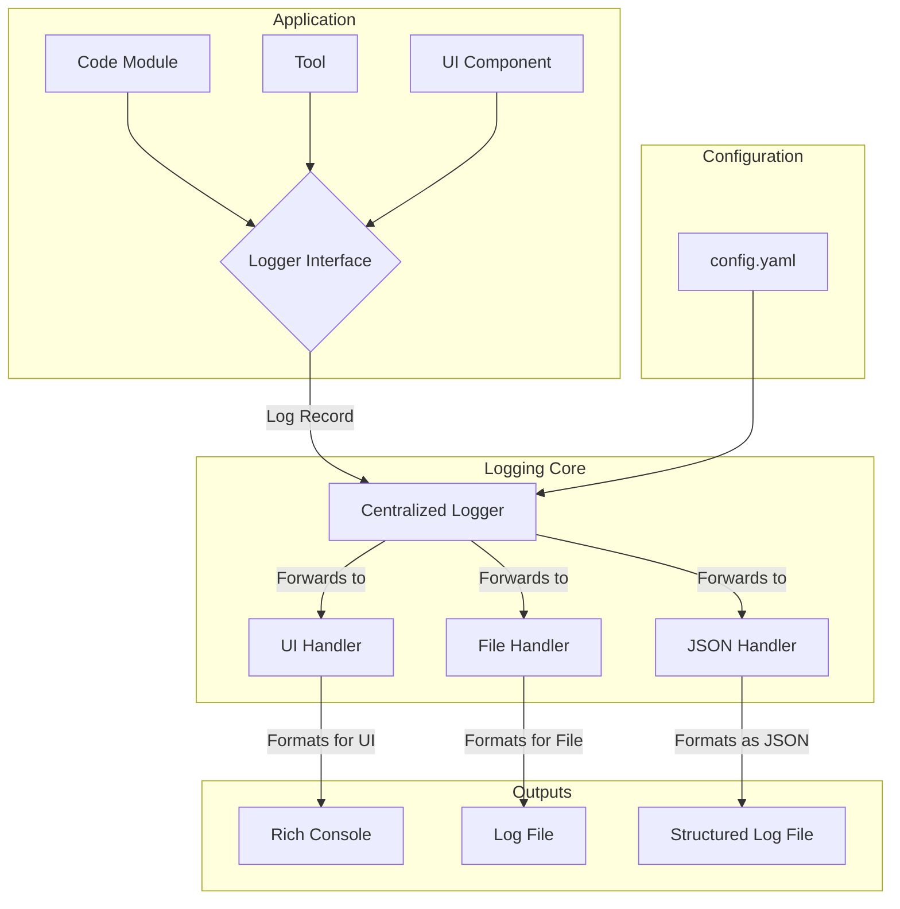

# TunaCode Unified Logging Plan

## Executive Summary

This document outlines a comprehensive plan to unify TunaCode's fragmented logging system. Currently, the application uses two independent systems: UI logging (using the rich library) and backend logging (using Python's logging module). This plan creates a single, unified logging architecture that addresses all current issues while providing flexibility for future needs.

## Current State Analysis

### Problems Identified
1. **Fragmented Systems**: UI logging and backend logging operate independently
2. **Inconsistent Formatting**: Errors displayed as panels, other messages as text
3. **Tight Coupling**: Tool logging is tightly coupled to UI, preventing backend logging
4. **No Centralized Configuration**: No single place to configure logging levels or outputs
5. **Scattered Debug Output**: Print statements used throughout for debugging

### Key Files Affected
- `src/tunacode/ui/output.py` - Current UI logging implementation
- `src/tunacode/core/agents/main.py` - Mixed logging approaches
- Various tool files in `src/tunacode/tools/`
- 9 files currently importing the logging module

## Unified Architecture Design



## Implementation Phases

### Phase 1: Foundation Setup (Week 1)

#### 1.1 Create Core Logging Module
**File**: `src/tunacode/logging/__init__.py`

**Tasks**:
- Define custom THOUGHT log level (value: 25)
- Create RichHandler class for UI output
- Implement setup_logging() function
- Create logging utilities and helpers

**Key Components**:
```python
# Custom log level
THOUGHT = 25
logging.addLevelName(THOUGHT, "THOUGHT")

# RichHandler for UI output
class RichHandler(logging.Handler):
    def emit(self, record):
        # Format and display using rich console
        pass

# Setup function
def setup_logging(config_path=None):
    # Load configuration
    # Set up formatters, handlers, and loggers
    pass
```

#### 1.2 Create Configuration Schema
**File**: `src/tunacode/configuration/logging_config.yaml`

**Structure**:
```yaml
logging:
  version: 1
  disable_existing_loggers: false
  
  formatters:
    simple:
      format: "[%(levelname)s] %(message)s"
    detailed:
      format: "[%(asctime)s] [%(levelname)s] [%(name)s:%(lineno)d] - %(message)s"
    json:
      class: "pythonjsonlogger.jsonlogger.JsonFormatter"
      format: "%(asctime)s %(name)s %(levelname)s %(message)s"
  
  handlers:
    ui:
      class: "tunacode.logging.RichHandler"
      level: "INFO"
      formatter: "simple"
    file:
      class: "logging.handlers.RotatingFileHandler"
      level: "DEBUG"
      formatter: "detailed"
      filename: "tunacode.log"
      maxBytes: 10485760  # 10MB
      backupCount: 5
    json_file:
      class: "logging.FileHandler"
      level: "DEBUG"
      formatter: "json"
      filename: "tunacode.json.log"
  
  root:
    level: "DEBUG"
    handlers: ["ui", "file", "json_file"]
  
  loggers:
    "tunacode.ui":
      level: "INFO"
      propagate: no
    "tunacode.tools":
      level: "DEBUG"
    "tunacode.core.agents":
      level: "DEBUG"
```

#### 1.3 Initialize Logging System
**File**: `src/tunacode/cli/main.py`

**Tasks**:
- Import and call setup_logging() at application startup
- Ensure logging is configured before any other imports
- Handle configuration loading errors gracefully

### Phase 2: Backend Migration (Week 2)

#### 2.1 Migrate Core Agent Logging
**File**: `src/tunacode/core/agents/main.py`

**Tasks**:
- Replace all print() statements with appropriate logger calls
- Convert existing logging.error() to logger.error()
- Add THOUGHT level logging for agent reasoning
- Add performance logging at DEBUG level

**Example Conversions**:
```python
# Before
print("📄 TUNACODE.md located: Loading context...")
logging.error(f"Error executing parallel tool: {e}", exc_info=True)

# After
logger.info("TUNACODE.md located: Loading context...")
logger.error(f"Error executing parallel tool: {e}", exc_info=True)
```

#### 2.2 Migrate Tool Logging
**Files**: All files in `src/tunacode/tools/`

**Tasks**:
- Add logger instance to each tool module
- Log tool execution start/end
- Log errors with full context
- Add DEBUG level performance metrics

**Template for Each Tool**:
```python
import logging
logger = logging.getLogger(__name__)

def tool_function(args):
    logger.info(f"Starting {tool_name} with args: {args}")
    start_time = time.time()
    try:
        # Tool logic
        result = perform_operation()
        elapsed = time.time() - start_time
        logger.debug(f"{tool_name} completed in {elapsed:.2f}s")
        return result
    except Exception as e:
        logger.error(f"{tool_name} failed: {str(e)}", exc_info=True)
        raise
```

#### 2.3 Migrate Remaining Backend Modules
**Files**: All other files using logging or print()

**Tasks**:
- Systematically review each file
- Replace print() and logging calls
- Add appropriate log levels
- Ensure consistent naming conventions

### Phase 3: UI Migration (Week 3)

#### 3.1 Create Compatibility Layer
**File**: `src/tunacode/ui/output_compat.py`

**Purpose**: Temporary compatibility layer to ease migration

**Tasks**:
- Create wrapper functions that map old UI functions to new logger
- Mark all functions as deprecated
- Add warnings when deprecated functions are used

#### 3.2 Migrate UI Components
**Files**: All files importing from `tunacode.ui.output`

**Tasks**:
- Replace ui.info() → logger.info()
- Replace ui.warning() → logger.warning()
- Replace ui.error() → logger.error()
- Replace ui.muted() → logger.debug() or logger.log(THOUGHT, ...)
- Update imports

#### 3.3 Remove Legacy Code
**Tasks**:
- Remove `src/tunacode/ui/output.py`
- Remove compatibility layer
- Clean up any remaining references
- Update documentation

## Configuration Details

### Log Levels

| Level | Value | Purpose | UI Display | Backend |
|-------|-------|---------|------------|---------|
| DEBUG | 10 | Detailed diagnostic info | Optional | Yes |
| INFO | 20 | General operational info | Yes | Yes |
| THOUGHT | 25 | Agent reasoning (custom) | Optional | Yes |
| WARNING | 30 | Unexpected events | Yes ⚠️ | Yes |
| ERROR | 40 | Serious problems | Yes ❌ | Yes |
| CRITICAL | 50 | Severe errors | Yes 🚨 | Yes |

### Format Specifications

#### UI Format
- INFO: `[timestamp] message`
- WARNING: `[timestamp] ⚠️ message`
- ERROR: `[timestamp] ❌ message`
- THOUGHT: `[timestamp] 🤔 message`

#### Backend Text Format
`[%(asctime)s] [%(levelname)s] [%(name)s:%(lineno)d] - %(message)s`

#### Backend JSON Format
```json
{
  "timestamp": "2025-07-30T21:15:37.514Z",
  "level": "INFO",
  "name": "tunacode.core.agents.main",
  "line": 522,
  "message": "TUNACODE.md located: Loading context...",
  "extra_data": {}
}
```

## Testing Strategy

### Phase 1 Testing
- Verify logging module loads correctly
- Test all handlers work independently
- Validate configuration loading
- Ensure backward compatibility

### Phase 2 Testing
- Verify no print() statements remain in backend
- Test log levels work correctly
- Validate performance logging
- Check error handling and stack traces

### Phase 3 Testing
- Ensure UI displays logs correctly
- Verify no regression in user experience
- Test all log levels appear appropriately
- Validate removal of old code

## Rollback Plan

Each phase can be rolled back independently:

1. **Phase 1**: Remove new logging module and configuration
2. **Phase 2**: Revert backend changes (git revert)
3. **Phase 3**: Restore UI output module and revert UI changes

## Success Metrics

1. **Unified System**: Single logging configuration controls all output
2. **Consistent Format**: All logs follow defined formats
3. **Decoupled Architecture**: Tools and UI no longer tightly coupled
4. **Performance**: No noticeable performance degradation
5. **Maintainability**: Easier to add new log destinations or modify behavior

## Timeline

- **Week 1**: Phase 1 - Foundation Setup
- **Week 2**: Phase 2 - Backend Migration
- **Week 3**: Phase 3 - UI Migration
- **Week 4**: Testing, documentation, and cleanup

## Next Steps

1. Review and approve this plan
2. Create implementation tickets for each phase
3. Begin Phase 1 implementation
4. Set up monitoring for the new logging system
5. Plan for future enhancements (e.g., remote logging)