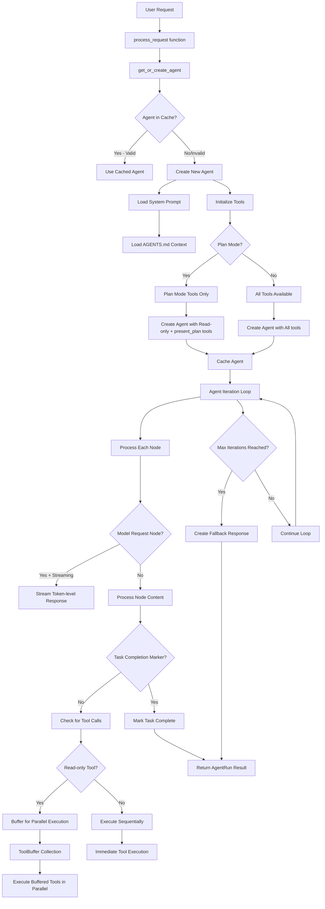

Now I have a good understanding of how the agent system works. Let me create a flowchart to explain the agent creation and processing flow:

## TunaCode Agent Creation and Processing Flow

## Detailed Flow Explanation

### 1. **Agent Creation Process**
- **`get_or_create_agent(model, state_manager)`** is called for each request
- Uses dual caching system (session-level and module-level)
- Cache invalidation based on configuration changes
- Loads system prompt from `src/tunacode/prompts/system.md`
- Appends AGENTS.md project context if available
- Dynamically configures tools based on mode (plan vs normal)

### 2. **Plan Mode vs Normal Mode**
- **Plan Mode**: Restricted to read-only tools + `present_plan` tool
- **Normal Mode**: Full toolset including write/execute tools
- System prompt is completely replaced in plan mode with plan-specific instructions

### 3. **Request Processing Loop**
- **`process_request()`** creates agent iteration context
- Processes nodes one by one in async loop
- Handles streaming responses at token level
- Monitors for task completion markers (`TUNACODE DONE:`)
- Implements productivity tracking (3 consecutive empty iterations triggers action)
- Manages tool execution batching for performance

### 4. **Tool Execution Strategy**
- **Read-only tools** (read_file, grep, list_dir, glob) are buffered for parallel execution
- **Write/execute tools** (bash, run_command, write_file, update_file) run sequentially
- **ToolBuffer** collects multiple read-only tools and executes them in batches
- Provides speedup metrics and visual feedback during batch execution

### 5. **Completion Detection**
- Looks for `TUNACODE DONE:` marker in response content
- Validates that no tools are queued when completion is signaled
- Prevents premature completion when tools are pending
- Handles fallback responses when iterations are exhausted

### 6. **State Management**
- Uses **ResponseState** with enum-based state machine
- Tracks: USER_INPUT → ASSISTANT → TOOL_EXECUTION → RESPONSE transitions
- Maintains backward compatibility with boolean flags
- Session state persists across requests with caching

The system is designed for optimal performance through parallel tool execution while maintaining safety through sequential write operations and comprehensive state tracking.
