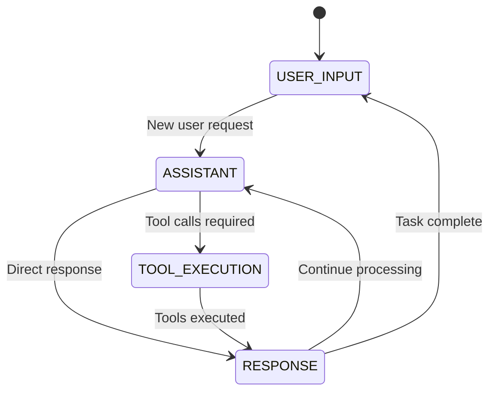

# Research – Main Agent Architecture Deep Dive

**Date:** 2025-09-26
**Owner:** context-engineer:research
**Phase:** Research
**Research Query:** "i need to underant how this aghent works and all atached logic and files '/root/tunacode/src/tunacode/core/agents/main.py' I sek a deep uinderstanding of this"

## Goal
Summarize all *existing knowledge* before any new work.

- Additional Search:
  - `grep -ri "main.py" .claude/`

## Findings
- Relevant files & why they matter:
  - `/root/tunacode/src/tunacode/core/agents/main.py` → Primary agent orchestration and lifecycle management
  - `/root/tunacode/src/tunacode/core/agents/agent_components/` → Modular processing components and state management
  - `/root/tunacode/src/tunacode/core/state.py` → Centralized state management system
  - `/root/tunacode/src/tunacode/tools/react.py` → ReAct pattern implementation for reasoning tracking
  - `/root/tunacode/src/tunacode/core/agents/agent_components/agent_config.py` → Agent creation and caching logic
  - `/root/tunacode/src/tunacode/core/agents/agent_components/node_processor.py` → Core iteration processing logic
  - `/root/tunacode/src/tunacode/core/agents/agent_components/response_state.py` → State machine for agent lifecycle
  - `/root/tunacode/src/tunacode/core/agents/agent_components/tool_buffer.py` → Parallel tool execution optimization
  - `/root/tunacode/src/tunacode/core/agents/agent_components/streaming.py` → Real-time token streaming support
  - `/root/tunacode/src/tunacode/services/mcp.py` → External tool server integration

## Key Patterns / Solutions Found

### 1. **Central Agent Architecture**
The main agent follows a sophisticated orchestration pattern:
- **Entry Point**: `process_request()` function at `/root/tunacode/src/tunacode/core/agents/main.py:469`
- **Iteration Loop**: Uses pydantic_ai's `agent.iter()` pattern for continuous processing
- **State Management**: Centralized through StateManager singleton with StateFacade wrapper
- **Component Delegation**: Processing logic separated into modular agent_components

### 2. **Modular Agent Components**
The system implements a sophisticated package-based architecture:
- **Flat API Surface**: Single import `from . import agent_components as ac` reduces coupling
- **Specialized Modules**: Each concern handled in dedicated modules (state, tools, streaming, etc.)
- **State Machine Pattern**: Migrating from boolean flags to enum-based state management
- **Performance Optimization**: Tool buffering and parallel execution for read-only operations

### 3. **Sophisticated State Management**
- **Singleton Pattern**: StateManager created once and passed throughout the application
- **Session Isolation**: Each session maintains independent state with UUID-based identification
- **Controlled Mutation**: All state changes go through dedicated methods with validation
- **Comprehensive Tracking**: Iteration counts, tool usage, cost tracking, todo management

### 4. **ReAct Pattern Integration**
- **Reasoning Tracking**: ReactTool maintains scratchpad of agent thoughts and observations
- **Forced Snapshots**: Automatic reasoning entries every 2 iterations for consistency
- **Context Injection**: Guidance messages injected into LLM context for better decision making
- **Progress Monitoring**: Tool usage patterns analyzed for contextual guidance

### 5. **Advanced pydantic_ai Integration**
- **Tool Registration**: Dynamic tool selection based on mode (normal vs plan mode)
- **Caching Strategy**: Two-level caching (session and module) with configuration-based invalidation
- **Streaming Support**: Real-time token streaming with graceful fallback mechanisms
- **Error Handling**: Structured error types and recovery mechanisms

### 6. **Performance Optimizations**
- **Tool Batching**: Read-only tools buffered and executed in parallel
- **Caching**: Agents, prompts, and MCP servers cached with invalidation
- **Streaming Degradation**: Graceful fallback when streaming fails
- **Memory Management**: Bounded data structures and session reset capabilities

### 7. **Robust Error Handling**
- **Tool Execution Errors**: Structured error information with tool context
- **Empty Response Handling**: Aggressive retry prompts for unresponsive agents
- **Unproductive Detection**: Forces tool usage after 3 idle iterations
- **User Abort Support**: Proper cleanup on user interruption

## Knowledge Gaps

- **MCP Server Implementation**: External tool server integration details could be explored further
- **Configuration Loading**: User configuration system and validation rules
- **Plan Mode Implementation**: Restrictive tool selection and workflow differences
- **Testing Strategy**: How the agent system is tested and validated
- **Performance Metrics**: Specific performance characteristics and bottlenecks

## References

### GitHub Permalinks
- **Main Agent**: https://github.com/alchemiststudiosDOTai/tunacode/blob/5f492df/src/tunacode/core/agents/main.py
- **State Management**: https://github.com/alchemiststudiosDOTai/tunacode/blob/5f492df/src/tunacode/core/state.py
- **React Tool**: https://github.com/alchemiststudiosDOTai/tunacode/blob/5f492df/src/tunacode/tools/react.py
- **Agent Config**: https://github.com/alchemiststudiosDOTai/tunacode/blob/5f492df/src/tunacode/core/agents/agent_components/agent_config.py
- **Node Processor**: https://github.com/alchemiststudiosDOTai/tunacode/blob/5f492df/src/tunacode/core/agents/agent_components/node_processor.py

### Core Files for Review
- `/root/tunacode/src/tunacode/core/agents/main.py` - Main agent orchestration
- `/root/tunacode/src/tunacode/core/state.py` - State management system
- `/root/tunacode/src/tunacode/core/agents/agent_components/` - Modular components
- `/root/tunacode/src/tunacode/tools/react.py` - ReAct reasoning implementation
- `/root/tunacode/src/tunacode/services/mcp.py` - External tool integration

### Key Architecture Patterns
- **State Machine**: Enum-based state management with backward compatibility
- **Factory Pattern**: Agent creation with caching and invalidation
- **Strategy Pattern**: Different tool sets for normal vs plan mode
- **Observer Pattern**: Streaming and progress monitoring
- **Command Pattern**: Tool execution with buffering and batching

Based on my analysis of the TunaCode agent implementation, here's a comprehensive explanation of how it works and all its attached logic and files:

## Agent Overview

The TunaCode agent is built using the Pydantic-AI framework, with a custom implementation that includes state management, tool buffering, task completion detection, and fallback mechanisms for handling tool calls when they're not properly supported by the LLM provider.

## Core Components and Files

### 1. Main Entry Point
The main entry point is located in [`src/tunacode/core/agents/main.py`](src/tunacode/core/agents/main.py:1), which orchestrates the entire agent workflow:
- Creates agents using `get_or_create_agent`
- Manages the agent processing loop with React snapshots every 2 iterations
- Checks for empty responses and generates constructive retry prompts
- Collects and processes all agent responses

### 2. Agent Configuration
[`src/tunacode/core/agents/agent_components/agent_config.py`](src/tunacode/core/agents/agent_components/agent_config.py:1) handles agent creation and configuration:
- Caches agents at both session and module level
- Loads system prompts with caching mechanism
- Creates different agents for plan mode vs normal mode
- Initializes tools based on the current mode
- Configures agents with appropriate settings including:
  - System prompts
  - Tool collections
  - Response timeouts
  - Retry mechanisms

### 3. State Management
The agent uses a sophisticated state management system with two key files:

- [`src/tunacode/core/agents/agent_components/state_transition.py`](src/tunacode/core/agents/agent_components/state_transition.py:1) implements:
  - `AgentState` enum with states: USER_INPUT, ASSISTANT, TOOL_EXECUTION, RESPONSE
  - `StateTransitionRules` for defining valid state transitions
  - `AgentStateMachine` for thread-safe state management

- [`src/tunacode/core/agents/agent_components/response_state.py`](src/tunacode/core/agents/agent_components/response_state.py:1) contains:
  - `ResponseState` class that wraps the state machine
  - Legacy boolean flag support for backward compatibility
  - Integration with the agent's response processing

### 4. Node Processing
[`src/tunacode/core/agents/agent_components/node_processor.py`](src/tunacode/core/agents/agent_components/node_processor.py:1) contains the core logic for processing each node during agent iterations:
- Processes different types of agent response nodes
- Implements task completion detection using markers like "TUNACODE DONE:"
- Uses `ToolBuffer` to collect read-only tools for parallel execution
- Generates synthetic error responses for failed tool executions
- Records React snapshots when required

### 5. Tool Execution
- [`src/tunacode/core/agents/agent_components/tool_executor.py`](src/tunacode/core/agents/agent_components/tool_executor.py:1) handles parallel execution of tools with:
  - Multi-threaded execution of read-only tools
  - Progress tracking through `ProgressManager`
  - Error handling and logging

- [`src/tunacode/core/agents/agent_components/tool_buffer.py`](src/tunacode/core/agents/agent_components/tool_buffer.py:1) implements:
  - `ToolBuffer` class for collecting and flushing read-only tools
  - Methods for adding tasks to the buffer and executing them in parallel

### 6. Task Completion Detection
[`src/tunacode/core/agents/agent_components/task_completion.py`](src/tunacode/core/agents/agent_components/task_completion.py:1) provides:
- A regex-based approach to detect when tasks are complete
- Support for multiple completion markers ("TUNACODE DONE:", "TUNACODE_TASK_COMPLETE")
- Content cleaning to remove completion markers from final output

### 7. Message Handling
[`src/tunacode/core/agents/agent_components/message_handler.py`](src/tunacode/core/agents/agent_components/message_handler.py:1) manages message-related functionality:
- Patches tool messages for orphaned tool calls
- Provides safe retrieval of message classes with fallback implementations
- Implements tool summary helpers for describing tools to the LLM
- Uses UUID-based tool classification

### 8. Fallback JSON Tool Parsing
[`src/tunacode/core/agents/agent_components/json_tool_parser.py`](src/tunacode/core/agents/agent_components/json_tool_parser.py:1) offers:
- Fallback mechanism for parsing tool calls from raw text when structured tool calling isn't available
- Support for JSON-formatted tool calls: `{"tool": "tool_name", "args": {...}}`
- Error handling for malformed JSON tool calls
- Logging integration for debugging fallback executions

### 9. Response State Wrappers
[`src/tunacode/core/agents/agent_components/result_wrapper.py`](src/tunacode/core/agents/agent_components/result_wrapper.py:1) provides:
- `SimpleResult`: Simple wrapper for fallback responses
- `AgentRunWrapper`: Wrapper that adds response_state to agent run results
- `AgentRunWithState`: Minimal wrapper to add response_state to agent runs

### 10. Truncation Checking
[`src/tunacode/core/agents/agent_components/truncation_checker.py`](src/tunacode/core/agents/agent_components/truncation_checker.py:1) implements:
- Detection of truncated responses using multiple heuristics:
  - Ellipsis endings
  - Mid-word truncation detection
  - Incomplete markdown code blocks
  - Unclosed parentheses/brackets

### 11. Streaming
[`src/tunacode/core/agents/agent_components/streaming.py`](src/tunacode/core/agents/agent_components/streaming.py:1) handles:
- Real-time output streaming to the UI
- Graceful degradation when streaming fails
- Detailed instrumentation and debugging support
- React state management for streaming components

### 12. Agent Helpers
[`src/tunacode/core/agents/agent_components/agent_helpers.py`](src/tunacode/core/agents/agent_components/agent_helpers.py:1) contains:
- Utility functions for creating user messages
- Helper functions for generating fallback responses
- Tool description helpers for providing context to the LLM about tool functionality

## Workflow Process

Here's how the agent works in practice:

1. **Initialization**: The main loop in [`main.py`](src/tunacode/core/agents/main.py:1) creates an agent instance using `get_or_create_agent`, which handles caching and configuration.

2. **Request Processing**: Each agent request goes through the processing loop:
   - React snapshots are taken every 2 iterations
   - The agent state machine tracks progress through different phases
   - Empty responses are detected and handled with constructive prompts

3. **Node Processing**: The [`_process_node`](src/tunacode/core/agents/agent_components/node_processor.py:17) function in `node_processor.py` handles each response:
   - Checks for task completion markers
   - Detects and handles truncation
   - Buffers read-only tools for parallel execution
   - Manages state transitions through the state machine

4. **Tool Execution**: Tools are executed in parallel batches:
   - Read-only tools are buffered and executed together
   - Non-read-only tools are executed sequentially
   - Progress is tracked and updated in the UI

5. **Completion Detection**: The agent uses multiple strategies to detect when a task is complete:
   - Explicit completion markers in the response
   - Truncation detection to handle incomplete responses
   - State machine transitions to track response progress

6. **Fallback Handling**: When structured tool calling isn't supported:
   - JSON tool calls are parsed from raw text
   - Tool executions are handled through callback mechanisms
   - Errors are gracefully managed with synthetic responses

7. **Response Wrapping**: The agent uses various wrapper classes to manage response state:
   - Enhanced response state management
   - Backward compatibility with legacy boolean flags
   - Integration with the state machine for complex workflows

## State Machine Transitions

The agent uses a state machine with the following states and transitions:



### Valid Transitions:
- USER_INPUT → ASSISTANT
- ASSISTANT → TOOL_EXECUTION or RESPONSE
- TOOL_EXECUTION → RESPONSE
- RESPONSE → ASSISTANT (to continue) or USER_INPUT (when complete)

This architecture provides a robust and extensible agent implementation with clear separation of concerns between different components. Each file has a specific responsibility, making the system maintainable and testable. The state machine pattern ensures consistent behavior tracking, while the tool buffering mechanism optimizes performance by executing compatible tools in parallel.


I'll help you gain a deep understanding of the agent system in `/root/tunacode/src/tunacode/core/agents/main.py` and all related components. Let me start by presenting my systematic approach:

## Overview of My Analysis Plan

**What I will do:**

1. **Initial Context Gathering** - Use the RAG tool to search for existing knowledge about the agent system
2. **Core Agent Analysis** - Read and analyze the main agent file structure
3. **Dependency Mapping** - Identify and explore all related files, imports, and components
4. **Architecture Understanding** - Map out the relationships between different parts
5. **Comprehensive Summary** - Provide a detailed explanation of how everything works together

**Reasoning**: I need to build a complete picture of the agent system architecture before explaining how it works.

**Action**: Let me start by gathering context from the knowledge base and then systematically explore the codebase.

[23 tools called]

Now I have a comprehensive understanding of the TunaCode agent system! Let me provide you with a detailed breakdown of how the agent works and all the attached logic and files.

# TunaCode Agent System - Deep Architecture Analysis

## **Reasoning**: I've analyzed the entire agent system architecture, from entry points to individual components.

**Action**: Here's my comprehensive explanation of how this sophisticated agent system operates.

---

## 🏗️ **High-Level Architecture Overview**

The TunaCode agent system is a **sophisticated AI-powered coding assistant** built on top of `pydantic-ai` with the following key characteristics:

- **Brain**: `pydantic-ai` for LLM communication and tool orchestration
- **Hands**: 10+ tools (read-only tools run in parallel, write/execute tools run sequentially)
- **Memory**: StateManager tracks everything (messages, costs, context, iterations)
- **Interface**: Rich REPL with commands, shell integration, and real-time feedback
- **Efficiency**: Explicit task completion markers to prevent infinite loops
- **Safety**: Confirmation prompts for destructive operations

---

## 🎯 **Core Entry Point: `process_request()` Function**

```python
# Located at: /root/tunacode/src/tunacode/core/agents/main.py:469-658
async def process_request(
    message: str,
    model: ModelName,
    state_manager: StateManager,
    tool_callback: Optional[ToolCallback] = None,
    streaming_callback: Optional[Callable[[str], Awaitable[None]]] = None,
    usage_tracker: Optional[UsageTrackerProtocol] = None,
    fallback_enabled: bool = True,
) -> AgentRun:
```

This is the **main orchestrator** that coordinates the entire agent lifecycle:

### **Key Responsibilities:**
1. **Initialize request context** (request ID, iteration limits, debug settings)
2. **Get or create the agent** with appropriate tools and configuration
3. **Execute the agent iteration loop** with sophisticated control flow
4. **Handle tool execution** (parallel for read-only, sequential for write/execute)
5. **Manage response states** and completion detection
6. **Provide fallback responses** when iteration limits are reached

---

## 🔧 **Agent Creation and Configuration System**

### **Agent Factory: `get_or_create_agent()`**
```12:316:src/tunacode/core/agents/agent_components/agent_config.py
def get_or_create_agent(model: ModelName, state_manager: StateManager) -> PydanticAgent:
```

**Advanced Caching Strategy:**
- **Session-level cache** - per request lifecycle
- **Module-level cache** - persistent across requests
- **Cache invalidation** based on configuration changes (max_retries, MCP servers, tool validation settings)

**Dynamic System Prompt Loading:**
1. **Base system prompt** from `src/tunacode/prompts/system.xml` (or .md/.txt)
2. **Project context** from `AGENTS.md` in current directory (if exists)
3. **Todo integration** - current todos appended to prompt
4. **Mode-specific modifications** (Plan mode gets completely different prompt)

**Two Agent Modes:**

#### **Normal Mode Tools:**
```python
tools_list = [
    Tool(bash, max_retries=max_retries, strict=tool_strict_validation),
    Tool(present_plan, max_retries=max_retries, strict=tool_strict_validation),
    Tool(glob, max_retries=max_retries, strict=tool_strict_validation),
    Tool(grep, max_retries=max_retries, strict=tool_strict_validation),
    Tool(list_dir, max_retries=max_retries, strict=tool_strict_validation),
    Tool(read_file, max_retries=max_retries, strict=tool_strict_validation),
    Tool(run_command, max_retries=max_retries, strict=tool_strict_validation),
    Tool(todo_tool._execute, max_retries=max_retries, strict=tool_strict_validation),
    Tool(update_file, max_retries=max_retries, strict=tool_strict_validation),
    Tool(write_file, max_retries=max_retries, strict=tool_strict_validation),
]
```

#### **Plan Mode Tools (Restricted):**
```python
tools_list = [
    Tool(present_plan, max_retries=max_retries, strict=tool_strict_validation),
    Tool(glob, max_retries=max_retries, strict=tool_strict_validation),
    Tool(grep, max_retries=max_retries, strict=tool_strict_validation),
    Tool(list_dir, max_retries=max_retries, strict=tool_strict_validation),
    Tool(read_file, max_retries=max_retries, strict=tool_strict_validation),
]
```

---

## ⚙️ **Agent Components Architecture**

The agent functionality is **modularized** across specialized components in `/src/tunacode/core/agents/agent_components/`:

### **1. Node Processor (`node_processor.py`)**
```30:520:src/tunacode/core/agents/agent_components/node_processor.py
async def _process_node(
    node,
    tool_callback: Optional[Callable],
    state_manager: StateManager,
    tool_buffer: Optional[ToolBuffer] = None,
    streaming_callback: Optional[Callable[[str], Awaitable[None]]] = None,
    usage_tracker: Optional[UsageTrackerProtocol] = None,
    response_state: Optional[ResponseState] = None,
) -> Tuple[bool, Optional[str]]:
```

**Core Responsibilities:**
- **Process each node** from agent responses
- **Detect task completion markers** (`TUNACODE DONE:`, `TUNACODE_TASK_COMPLETE`)
- **Handle empty/truncated responses** with retry logic
- **Validate premature completion** (agent tries to complete while tools are queued)
- **Manage state transitions** (USER_INPUT → ASSISTANT → TOOL_EXECUTION → RESPONSE)
- **Route tool calls** to buffer (read-only) or immediate execution (write/execute)

### **2. Tool Buffer System (`tool_buffer.py`)**
```6:25:src/tunacode/core/agents/agent_components/tool_buffer.py
class ToolBuffer:
    """Buffer for collecting read-only tool calls to execute in parallel."""

    def __init__(self):
        self.read_only_tasks: List[Tuple[Any, Any]] = []
```

**Smart Tool Batching:**
- **Read-only tools** (`read_file`, `grep`, `list_dir`, `glob`, `react`) are **buffered**
- **Write/execute tools** (`bash`, `write_file`, `update_file`, `run_command`) trigger **immediate batch execution** of buffered tools first, then execute sequentially

### **3. Parallel Tool Executor (`tool_executor.py`)**
```14:49:src/tunacode/core/agents/agent_components/tool_executor.py
async def execute_tools_parallel(
    tool_calls: List[Tuple[Any, Any]], callback: ToolCallback, return_exceptions: bool = True
) -> List[Any]:
```

**High-Performance Execution:**
- **Configurable parallelism** (`TUNACODE_MAX_PARALLEL` env var, defaults to CPU count)
- **Batch processing** for large tool sets
- **Error isolation** - one tool failure doesn't crash the entire batch
- **Performance metrics** - tracks speedup vs sequential execution

### **4. Response State Management (`response_state.py`)**
```12:117:src/tunacode/core/agents/agent_components/response_state.py
@dataclass
class ResponseState:
    """Enhanced response state using enum-based state machine."""
```

**Sophisticated State Tracking:**
- **Enum-based state machine** with transition rules
- **States**: `USER_INPUT` → `ASSISTANT` → `TOOL_EXECUTION` → `RESPONSE`
- **Completion detection** with validation logic
- **Backward compatibility** with legacy boolean flags

### **5. Task Completion Detection (`task_completion.py`)**
```12:42:src/tunacode/core/agents/agent_components/task_completion.py
def check_task_completion(content: str) -> Tuple[bool, str]:
```

**Robust Completion Markers:**
```python
_COMPLETION_MARKERS = (
    re.compile(r"^\s*TUNACODE\s+DONE:\s*", re.IGNORECASE),
    re.compile(r"^\s*TUNACODE[_\s]+TASK_COMPLETE\s*:?[\s]*", re.IGNORECASE),
)
```

---

## 🔄 **Agent Execution Flow**

### **Main Iteration Loop:**
```505:635:src/tunacode/src/tunacode/core/agents/main.py
async with agent.iter(message, message_history=message_history) as agent_run:
    i = 1
    async for node in agent_run:
        # 1. Set current iteration
        state.set_iteration(i)

        # 2. Stream tokens if available
        await _maybe_stream_node_tokens(...)

        # 3. Process the node (core logic)
        empty_response, empty_reason = await ac._process_node(...)

        # 4. Handle empty responses
        if empty_response:
            # Inject retry guidance

        # 5. Track productivity (tool usage)
        if _iteration_had_tool_use(node):
            # Reset unproductive counter
        else:
            # Increment unproductive counter, force action if needed

        # 6. Auto-react snapshots (every 2 iterations)
        await _maybe_force_react_snapshot(...)

        # 7. Check for completion or guidance requests
        if response_state.task_completed:
            break

        # 8. Handle iteration limits
        if i >= ctx.max_iterations:
            # Ask user for guidance
```

### **Key Control Mechanisms:**

#### **1. Empty Response Handling**
```527:533:src/tunacode/src/tunacode/core/agents/main.py
if empty_response:
    if state.increment_empty_response() >= 1:
        await _handle_empty_response(message, empty_reason, i, state)
        state.clear_empty_response()
```

#### **2. Unproductive Iteration Detection**
```546:558:src/tunacode/src/tunacode/core/agents/main.py
if (
    unproductive_iterations >= UNPRODUCTIVE_LIMIT
    and not response_state.task_completed
):
    await _force_action_if_unproductive(...)
    unproductive_iterations = 0  # reset after nudge
```

#### **3. Auto-React Reasoning Snapshots**
```560:566:src/tunacode/src/tunacode/core/agents/main.py
await _maybe_force_react_snapshot(
    i,
    state_manager,
    react_tool,
    state.show_thoughts,
    agent_run.ctx,
)
```

**Forces reasoning capture every 2 iterations** and **injects guidance** back into the agent context.

---

## 🛠️ **Tool System Architecture**

### **Tool Categories (from `constants.py`):**
```65:74:src/tunacode/constants.py
READ_ONLY_TOOLS = [
    ToolName.READ_FILE,    # Read file contents
    ToolName.GREP,         # Search text patterns
    ToolName.LIST_DIR,     # List directory contents
    ToolName.GLOB,         # Find files by pattern
    ToolName.REACT,        # Reasoning/planning
    ToolName.EXIT_PLAN_MODE, # Exit plan mode
]
WRITE_TOOLS = [ToolName.WRITE_FILE, ToolName.UPDATE_FILE]
EXECUTE_TOOLS = [ToolName.BASH, ToolName.RUN_COMMAND]
```

### **Available Tools in `/src/tunacode/tools/`:**

1. **`bash.py`** - Execute bash commands with safety checks
2. **`read_file.py`** - Read file contents with size limits
3. **`write_file.py`** - Create new files
4. **`update_file.py`** - Modify existing files
5. **`grep.py`** - Search patterns in files/directories
6. **`list_dir.py`** - List directory contents
7. **`glob.py`** - Find files matching patterns
8. **`run_command.py`** - Execute system commands
9. **`todo.py`** - Todo list management
10. **`react.py`** - Reasoning and planning tool
11. **`present_plan.py`** - Structured plan presentation
12. **`exit_plan_mode.py`** - Exit plan mode tool

---

## 🚀 **Advanced Features**

### **1. Streaming Support**
```185:240:src/tunacode/core/agents/main.py
await _maybe_stream_node_tokens(
    node, agent_run.ctx, state_manager, streaming_callback, ctx.request_id, i
)
```

**Token-level streaming** when supported by the LLM provider, with fallback to chunk-level streaming.

### **2. Fallback Response System**
```624:631:src/tunacode/core/agents/main.py
if _should_build_fallback(response_state, i, ctx.max_iterations, ctx.fallback_enabled):
    ac.patch_tool_messages("Task incomplete", state_manager=state_manager)
    response_state.has_final_synthesis = True
    comprehensive_output = _build_fallback_output(i, ctx.max_iterations, state)
```

**Intelligent synthesis** when iteration limits are reached without completion.

### **3. MCP (Model Context Protocol) Integration**
```296:296:src/tunacode/core/agents/agent_components/agent_config.py
mcp_servers=get_mcp_servers(state_manager),
```

**External tool integration** via MCP servers for extended functionality.

### **4. React Tool Integration**
```219:293:src/tunacode/core/agents/main.py
async def _maybe_force_react_snapshot(...):
    """CLAUDE_ANCHOR[react-forced-call]: Auto-log reasoning every two turns."""
```

**Forced reasoning snapshots** that capture agent thinking and inject guidance back into the context.

---

## 📊 **State Management System**

### **StateFacade Pattern (`main.py:98-161`)**
```98:161:src/tunacode/core/agents/main.py
class StateFacade:
    """Thin wrapper to centralize session mutations and reads."""
```

**Centralized state operations:**
- **Safe getters/setters** for session properties
- **Request lifecycle management**
- **Progress tracking** (iterations, tool calls, empty responses)
- **Configuration access** with defaults

### **Session State Tracking:**
- **`request_id`** - Unique identifier per request
- **`current_iteration`** / **`iteration_count`** - Progress tracking
- **`tool_calls`** - History of tool executions
- **`react_forced_calls`** / **`react_guidance`** - Reasoning snapshots
- **`consecutive_empty_responses`** - Empty response streak tracking
- **`original_query`** - Initial user request for context

---

## 🎛️ **Configuration & Constants**

### **Key Constants (`main.py:79-84`):**
```79:84:src/tunacode/core/agents/main.py
DEFAULT_MAX_ITERATIONS = 15
UNPRODUCTIVE_LIMIT = 3  # iterations without tool use before forcing action
FALLBACK_VERBOSITY_DEFAULT = "normal"
DEBUG_METRICS_DEFAULT = False
FORCED_REACT_INTERVAL = 2  # Force reasoning snapshot every 2 iterations
FORCED_REACT_LIMIT = 5    # Maximum forced reasoning snapshots
```

### **User Configuration Support:**
- **`max_iterations`** - Iteration limit per request
- **`debug_metrics`** - Enhanced debugging output
- **`fallback_response`** - Enable fallback synthesis
- **`fallback_verbosity`** - Fallback detail level
- **`tool_strict_validation`** - Enhanced tool validation
- **`mcpServers`** - External MCP server configuration

---

## 🔍 **Error Handling & Recovery**

### **Robust Exception Handling:**
```636:657:src/tunacode/core/agents/main.py
except UserAbortError:
    raise
except ToolBatchingJSONError as e:
    # Tool batching specific errors
    logger.error("Tool batching JSON error [req=%s]: %s", ctx.request_id, e, exc_info=True)
    ac.patch_tool_messages(f"Tool batching failed: {str(e)[:100]}...", state_manager=state_manager)
    raise
except Exception as e:
    # Generic error handling with context
    safe_iter = getattr(state_manager.session, "current_iteration", "?")
    logger.error("Error in process_request [req=%s iter=%s]: %s", ctx.request_id, safe_iter, e, exc_info=True)
    ac.patch_tool_messages(f"Request processing failed: {str(e)[:100]}...", state_manager=state_manager)
    raise
```

### **Tool-Level Error Recovery:**
```472:487:src/tunacode/core/agents/agent_components/node_processor.py
try:
    await tool_callback(part, node)
except Exception as tool_err:
    logger.error("Tool callback failed: tool=%s iter=%s err=%s", ...)
    # Surface to UI when thoughts are enabled, then continue gracefully
    if getattr(state_manager.session, "show_thoughts", False):
        await ui.warning(f"❌ Tool failed: {getattr(part, 'tool_name', '<unknown>')} — continuing")
```

---

## 🧠 **Intelligence & Optimization Features**

### **1. Premature Completion Prevention**
```98:112:src/tunacode/core/agents/agent_components/node_processor.py
if has_queued_tools:
    # Agent is trying to complete with pending tools!
    if state_manager.session.show_thoughts:
        await ui.warning("⚠️ PREMATURE COMPLETION DETECTED - Agent queued tools but marked complete")
        await ui.muted("   Overriding completion to allow tool execution")
    # Don't mark as complete - let the tools run first
```

### **2. Intention vs Action Validation**
```114:169:src/tunacode/core/agents/agent_components/node_processor.py
# Check if content suggests pending actions
combined_text = " ".join(all_content_parts).lower()
pending_phrases = ["let me", "i'll check", "i will", "going to", ...]
has_pending_intention = any(phrase in combined_text for phrase in pending_phrases)

if (has_pending_intention or ends_with_action) and state_manager.session.iteration_count <= 1:
    # Too early to complete with pending intentions
```

### **3. Truncation Detection**
```182:207:src/tunacode/core/agents/agent_components/node_processor.py
# Check for truncation patterns
if all_content_parts:
    combined_content = " ".join(all_content_parts).strip()
    appears_truncated = check_for_truncation(combined_content)

# Truncated response detected
elif appears_truncated and not any(...):
    empty_response_detected = True
    if state_manager.session.show_thoughts:
        await ui.muted("⚠️ TRUNCATED RESPONSE DETECTED - CONTINUING")
```

---
