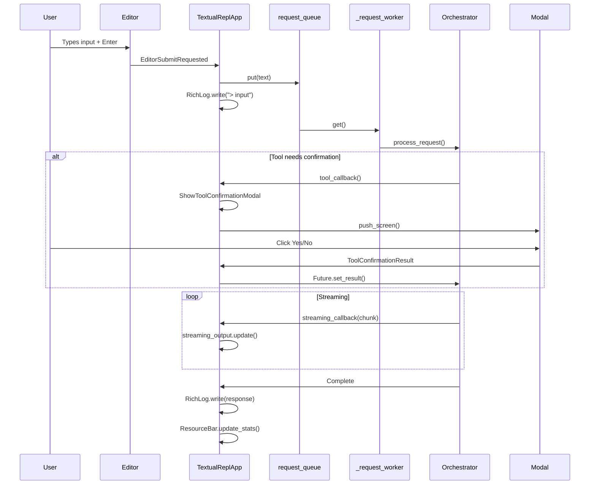
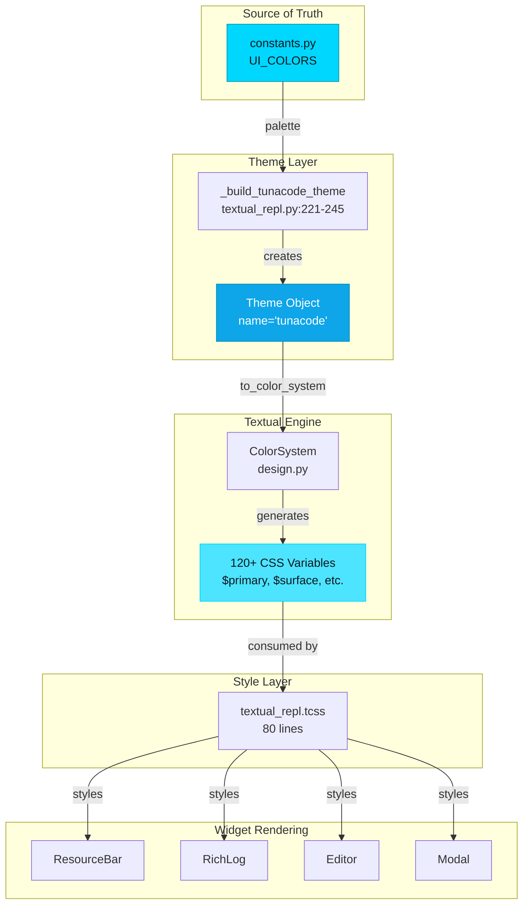
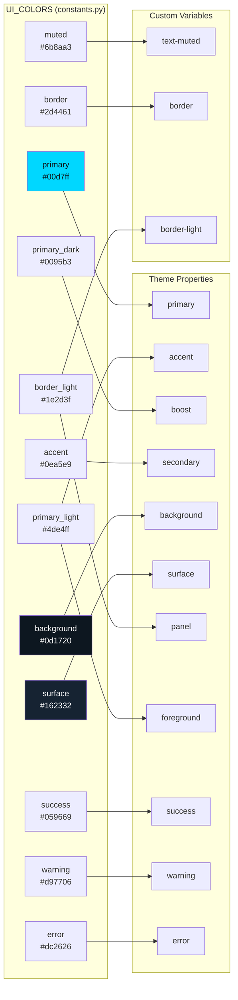
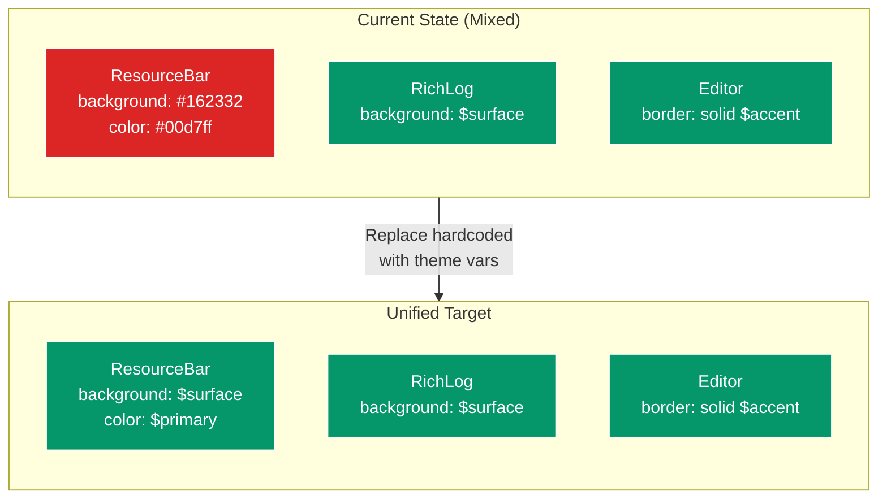
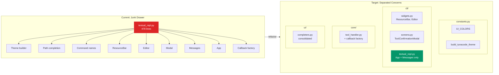
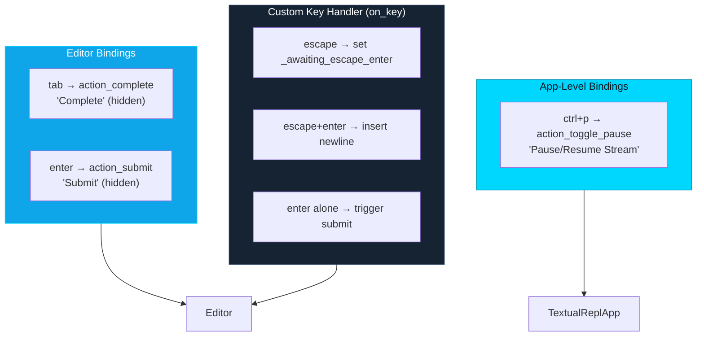

# Textual TUI Architecture Diagrams

## 1. Widget Hierarchy

```mermaid
graph TD
    subgraph TextualReplApp
        Header[Header<br/><i>built-in</i>]
        ResourceBar[ResourceBar<br/><i>Static</i>]

        subgraph Body["Vertical #body"]
            RichLog[RichLog<br/><i>conversation history</i>]
            StreamingOutput["Static #streaming-output<br/><i>live response</i>"]
            Editor[Editor<br/><i>TextArea + completions</i>]
        end

        Footer[Footer<br/><i>built-in</i>]
    end

    Header --> ResourceBar
    ResourceBar --> Body
    Body --> Footer

    RichLog --> StreamingOutput
    StreamingOutput --> Editor

    style Header fill:#2d4461,stroke:#00d7ff
    style Footer fill:#2d4461,stroke:#00d7ff
    style ResourceBar fill:#162332,stroke:#00d7ff,color:#00d7ff
    style RichLog fill:#162332,stroke:#2d4461
    style StreamingOutput fill:#162332,stroke:#2d4461
    style Editor fill:#0d1720,stroke:#0ea5e9
```

## 2. Message Flow Architecture

## 3. Theme & Styling Architecture

## 4. UI_COLORS Mapping

## 5. Current vs Unified Style Architecture

## 6. Complete System Overview

```mermaid
graph TB
    subgraph Entry["Entry Point"]
        CLI[run_textual_repl]
    end

    subgraph App["TextualReplApp"]
        subgraph State["App State"]
            SM[state_manager]
            RQ[request_queue]
            PC[pending_confirmation]
            SS[streaming state]
        end

        subgraph UI["Widget Tree"]
            H[Header]
            RB[ResourceBar]
            B["#body"]
            F[Footer]
        end

        subgraph Messages["Message Types"]
            M1[EditorSubmitRequested]
            M2[EditorCompletionsAvailable]
            M3[ShowToolConfirmationModal]
            M4[ToolConfirmationResult]
        end

        subgraph Handlers["Message Handlers"]
            H1[on_editor_submit_requested]
            H2[on_editor_completions_available]
            H3[on_show_tool_confirmation_modal]
            H4[on_tool_confirmation_result]
        end

        subgraph Workers["Background Workers"]
            RW[_request_worker]
        end
    end

    subgraph Core["Core Layer"]
        PR[process_request]
        TH[ToolHandler]
    end

    subgraph Theme["Theming"]
        UC[UI_COLORS]
        TT[tunacode Theme]
        TC[textual_repl.tcss]
    end

    CLI --> App
    SM --> RW
    RQ --> RW
    RW --> PR
    PR --> TH

    M1 --> H1
    M2 --> H2
    M3 --> H3
    M4 --> H4

    UC --> TT
    TT --> TC
    TC --> UI

    style Entry fill:#00d7ff,stroke:#0095b3,color:#0d1720
    style App fill:#162332,stroke:#2d4461
    style Core fill:#0d1720,stroke:#2d4461
    style Theme fill:#0ea5e9,stroke:#00d7ff
```

## 7. Current vs Target File Architecture

## 8. Binding Architecture

